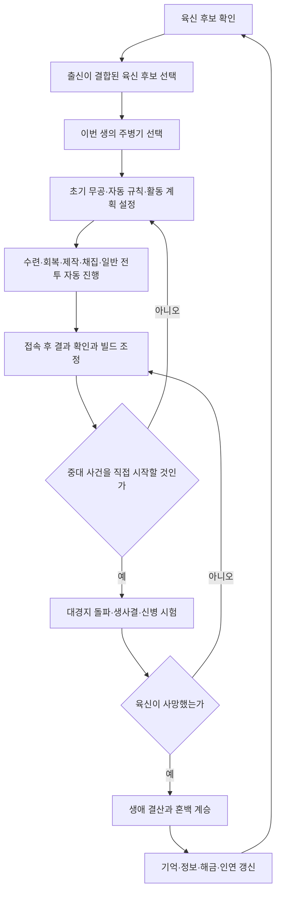

# FirstForm 핵심 게임 설계

> 문서 상태: 승인된 방향의 기준선
> 기준일: 2026-07-19
> 적용 범위: 기존 프로토타입 이후의 코어 시스템 개편
> 관련 문서: [성장 및 전투 시스템](ProgressionAndCombatSystems.md), [현재 시스템 감사](../Technical/CurrentSystemAudit.md), [데이터 아키텍처 초안](../Technical/DataArchitectureDraft.md), [코어 시스템 마이그레이션 계획](../Roadmap/CoreSystemMigrationPlan.md)

## 1. 게임 정체성

FirstForm은 **무협 회귀형 방치 로그라이트 RPG**다. 플레이어는 하나의 육신으로 여러 번 접속하며 한 생을 이어 가고, 죽음 이후에는 혼백에 남은 기억과 인연을 바탕으로 다른 육신과 성장 방향을 선택한다.

핵심 플레이 약속은 다음과 같다.

- 접속하지 않은 시간도 수련, 회복, 제작, 채집, 일반 전투 같은 반복 활동의 성과로 바뀐다.
- 부재 중에는 육신이 사망하거나 문파 가입, 대경지 돌파, 신병 계약 같은 비가역적 선택이 확정되지 않는다.
- 접속은 수시로 울리는 선택 알림을 처리하는 일이 아니라, 축적된 결과를 이해하고 다음 방향을 정하는 짧고 만족스러운 의사 결정 시간이다.
- 위험을 감수할 때는 플레이어가 위험과 보상을 확인하고 직접 시작한다.
- 한 생의 빌드는 유한하지만, 혼백이 얻은 정보·해금·인연은 다음 생의 선택 폭을 넓힌다.

### 공식 용어

| 용어 | 의미 |
| --- | --- |
| 생 | 한 육신을 선택한 순간부터 그 육신의 사망까지. 현재 코드의 `회차`는 legacy 표현으로 생 번호와 대응한다. |
| 접속 | 앱을 실행해 저장을 불러온 한 세션. 접속 종료는 생 종료가 아니다. |
| 육신 | 한 생의 자원·부상·경지·무공·장비를 소유하는 가변 개체 |
| 출신 | 육신 후보가 참조하는 콘텐츠 정의. 습득 경로와 사건 가중치를 바꾼다. |
| 무인의 경지 | 삼류부터 화경까지 18단계로 표현하는 인물의 성장 단계 |
| 무공 숙련 | 각 무공마다 별도로 쌓는 입문·소성·대성·극성 단계 |
| 병기 경험 | 병기 계열에 대한 경험. 일부가 혼백에 남을 수 있으며 무공 숙련과 다르다. |
| 사건 보관함 | 즉시 처리하지 않을 선택과 중대 사건을 재굴림 없이 저장하는 곳 |
| 일반 자동 행동 | 안전 규칙 안에서 온라인·오프라인 자동 처리할 수 있는 반복 활동 |
| 위험 행동 | 사망·중대한 손실 가능성을 고지하고 플레이어가 직접 시작하는 활동 |

## 2. 핵심 설계 원칙

### 2.1 부재 안전성

오프라인 진행은 **안전한 자동 행동의 정산**이다. 서버 또는 기기 시간이 흘렀다는 이유만으로 다음 결과가 발생해서는 안 된다.

- 육신 사망
- 대경지 돌파의 성공 또는 실패 확정
- 문파, 스승, 계약, 인연의 수락 또는 거절
- 신병이기 시험의 시작 또는 귀속
- 고유 장비 파괴, 영구 해금 취소 같은 핵심 자산 손실

위험도가 높아지면 자동 진행은 사전에 정한 안전 규칙에 따라 중단한다. 허용되는 오프라인 불이익은 자동 귀환, 부상, 확보 전 전리품의 일부 손실, 활동 효율 저하처럼 **범위가 고지된 경제적 손실**로 제한한다. 선택 자체를 대신 확정하거나 영구 자산을 소거해서는 안 된다.

### 2.2 위험의 명시적 시작

대경지 돌파, 생사결, 신병이기 시험과 계약은 `MajorRisk` 활동으로 분류한다. 이 활동은 다음 조건을 모두 만족해야 시작할 수 있다.

1. 플레이어가 위험, 예상 보상, 실패 결과를 확인한다.
2. 플레이어가 현재 접속 중 직접 시작한다.
3. 결과를 처리할 수 있는 저장 체크포인트가 만들어진다.
4. 앱이 종료되거나 정산이 중단되어도 동일 시도를 중복 적용하지 않는다.

일반 전투는 안전 규칙이 붙은 반복 활동이다. 자동 귀환 기준을 넘기 전까지 진행하며, 사망 가능 전투는 생사결처럼 별도의 위험 활동으로 승격한다.

### 2.3 선택은 보관하고 반복은 자동화

사건은 세 등급으로 구분한다.

| 등급 | 예시 | 처리 규칙 |
| --- | --- | --- |
| 자동 결과 | 일반 수련 틱, 회복, 흔한 채집, 안전 귀환 | 활동 계획과 자동 규칙으로 즉시 처리 |
| 보류 선택 | 새 무공 단서, 희귀 장비, 인연 사건 | 진행을 막지 않고 사건 보관함에 저장 |
| 중대 선택 | 대경지 돌파, 문파 선택, 신병 계약 | 보관함에 저장하며 플레이어가 직접 열어 확정 |

보류 선택과 중대 선택은 몇 분마다 전체 게임을 멈추지 않는다. 보관함 용량이나 유효 기간이 필요하다면 콘텐츠 정의에 명시하고, 만료로 핵심 선택을 자동 확정하지 않는다. 같은 사건의 반복 발생은 횟수나 단서 진척으로 합칠 수 있다.

### 2.4 방향을 정하고 떠나는 접속

플레이어의 중요한 입력은 순간 반응보다 다음 기간의 방침이다.

- 다음 활동: 수련, 회복, 제작, 채집, 출행
- 출행 목적: 재료, 무공 단서, 장비, 인연, 경지 준비 등
- 허용 위험도와 자동 귀환 기준
- 전투 방침: 생존, 균형, 공세와 세부 자동 대응 규칙
- 자동 장착, 보관, 분해 규칙

현재 `BattleManager`의 `AutoBattleResponseStyle`과 자동 강공 대응은 이 원칙의 초기 프로토타입으로 볼 수 있다. 다만 목표 구조에서는 짧은 제한 시간 입력에 의존하지 않고 저장 가능한 전투 방침으로 일반화한다.

### 2.5 생은 길고 빌드는 유한하다

한 육신의 생애는 한 번의 실행 세션이 아니라 여러 번의 접속에 걸쳐 이어진다. 앱 종료는 회차 종료가 아니며, 명시적으로 사망한 경우에만 새 생으로 넘어간다. 이번 생의 경지, 무공 숙련, 장비와 인벤토리, 성향, 부상, 활동 계획은 생이 끝날 때까지 이어진다.

### 2.6 조합이 수치보다 중요하다

병기는 이번 생의 직업 축이고, 출신·무공·장비·전투 방침은 그 축을 변주한다. 단일 공격력 수치가 높은 선택보다 다음과 같은 상호작용을 우선한다.

- 병기와 전용 무공의 적합성
- 출신이 제공하는 습득 경로와 사건 가중치
- 공통 보법·심법이 보완하는 생존 또는 자원 운용
- 장비 태그와 무공 효과의 연계
- 전투 방침과 적 전법의 상성

### 2.7 영구 성장은 선택 폭을 넓힌다

혼백 성장은 장기적으로 단순 공격력 누적보다 새로운 출신, 병기, 사건 정보, 시작 선택지, 자동 행동 규칙을 해금한다. 기존 `SoulGrowthData`의 직접 능력치 세 항목은 호환 대상이지만, 새 영구 성장의 중심 모델로 확대하지 않는다.

## 3. 접속 흐름

한 번의 일반 접속은 다음 순서로 끝까지 진행할 수 있어야 한다.

1. **저장 불러오기 및 검증**: 저장 버전을 판별하고, 활성 육신과 마지막 활동 체크포인트를 복원한다.
2. **오프라인 정산**: 마지막 체크포인트부터 현재 시각까지 안전한 활동만 결정론적으로 계산한다.
3. **귀환 보고 확인**: 획득·소모·부상·자동 귀환·중단 사유를 요약해서 보여 준다.
4. **보관 사건 확인**: 새 단서와 중요한 선택의 존재를 알리되 모두 처리하도록 강제하지 않는다.
5. **성장 및 정비**: 무공, 장비, 경지 준비도, 제작 결과를 확인하고 자동 규칙을 조정한다.
6. **다음 계획 지정**: 활동, 목적, 위험도, 전투 방침, 귀환 기준을 정한다.
7. **선택적 직접 플레이**: 준비된 대경지 돌파나 생사결 같은 중대 사건을 원할 때만 시작한다.
8. **체크포인트 저장 후 종료**: 다음 오프라인 정산의 입력을 확정한다.

보관 사건이 없다면 3~6단계만으로 짧게 종료할 수 있어야 한다. 오프라인 결과가 없더라도 활동 계획 변경과 중대 사건 실행은 가능하다.

## 4. 한 생의 전체 루프

### 4.1 새 생 준비

- 복수의 육신 후보 중 하나를 선택한다.
- 각 후보는 **육신 개체**와 **출신 정의**의 조합이다.
- 출신은 능력치뿐 아니라 무공, 장비, 사건, 스승과 인연의 출현 경로에 영향을 준다.
- 이번 생의 주병기를 선택한다. 초기 수직 슬라이스에서는 검만 완성하되 저장 구조는 다른 병기 계열을 수용한다.
- 혼백이 해금한 시작 선택지와 자동 규칙을 적용한다.

### 4.2 생의 성장

- 반복 활동으로 자원, 무공 숙련, 소경지 진척, 장비와 사건 단서를 얻는다.
- 소경지 상승은 자동 또는 한 번의 확인으로 처리한다.
- 대경지 경계에 도달하면 자동 진행을 멈추지 않고 `대경지 돌파 가능` 사건을 보관한다.
- 플레이어는 빌드와 준비도를 검토한 뒤 원하는 접속에서 돌파를 직접 시작한다.

### 4.3 죽음과 회귀

- 죽음은 플레이어가 명시적으로 시작한 사망 가능 활동의 결과여야 한다.
- 생이 끝나면 일반 장비와 이번 생의 자원은 대부분 소실된다.
- 혼백에는 병기 경험 일부, 전생의 기억, 사건 정보, 자동 규칙 해금, 신병이기 단서·인연·시험 결과가 남는다.
- 다음 생은 동일한 최적 선택을 반복하는 것이 아니라, 새로 열린 출신·병기·경로를 시험하는 기회가 된다.

## 5. 오프라인 진행 계약

오프라인 정산은 실시간 `Update()`를 빠르게 재생하는 기능이 아니라 별도의 시뮬레이션이다.

### 입력

- 저장된 시작 시각과 마지막 정산 체크포인트
- 활성 육신의 런타임 스냅샷
- 활동 계획과 목적
- 위험 허용치, 자동 귀환·소모품·전투 방침 규칙
- 적용할 콘텐츠 버전과 난수 시드

### 출력

- 활동별 경과 시간과 완료 횟수
- 획득·소모 자원 및 무공·경지 진척
- 자동 장착·보관·분해 결과
- 부상, 귀환, 미확보 전리품 손실과 중단 사유
- 사건 보관함에 추가된 선택
- 다음 정산의 체크포인트

### 불변 조건

- 동일한 입력과 시드에는 동일한 결과를 낸다.
- 같은 정산을 재시도해도 보상을 중복 지급하지 않는다.
- 콘텐츠를 찾지 못한 ID는 저장을 파괴하지 않고 격리·보고한다.
- 시계 역행, 비정상적으로 긴 공백, 정산 도중 종료를 안전하게 처리한다.
- 정산 시간 상한은 밸런스 데이터로 관리하며 이 문서에서는 특정 시간으로 확정하지 않는다.

## 6. 현재 프로토타입과의 연결

현재 `Assets/Scripts/Managers/GameManager.cs`의 `FirstFormGameState` 전환은 한 세션 안의 선형 MVP 루프를 제공한다. `TrainingManager`는 실시간 틱 수련 후 자동 출행하고, `ExplorationManager`는 짧은 단계 후 `BattleManager`로 연결한다. 이 흐름은 핵심 행동의 시험대로 유지할 수 있지만 다음 차이가 있다.

| 현재 프로토타입 | 목표 방향 |
| --- | --- |
| `TrainingManager.Update()`가 35초 뒤 자동 출행 | 저장된 활동 계획을 온라인·오프라인 공통 시뮬레이터가 처리 |
| 탐험 사건이 즉시 `ExplorationEvent` 상태로 전환 | 선택 사건을 보관함에 적재하고 반복 진행은 계속 |
| 일반 전투에서 체력 0이면 즉시 사망 | 안전한 일반 전투는 임계점에서 귀환, 사망 가능 전투는 직접 시작 |
| 경지 조건 충족 즉시 돌파 화면으로 전환 | 소경지는 자동, 대경지 돌파는 보관된 중대 사건 |
| 앱 종료 시 현재 생의 핵심 상태 일부만 저장 | 한 생이 여러 접속에 걸쳐 지속되도록 활동·육신·빌드 전체를 체크포인트화 |

구체적인 교체 경계와 호환 전략은 [현재 시스템 감사](../Technical/CurrentSystemAudit.md)와 [마이그레이션 계획](../Roadmap/CoreSystemMigrationPlan.md)에 정의한다.

## 7. 명시적 가정

- 현재 `BodyOriginData`는 육신과 출신을 한 객체로 합치지만, 목표 구조에서는 육신 개체 상태와 출신 콘텐츠를 분리한다. 후보 화면에서는 둘을 한 카드로 제시해도 된다.
- 새 생의 주병기 선택은 육신 선택 직후, 첫 활동 계획 전에 수행한다. 검 수직 슬라이스에서는 검이 유일한 완성 선택지임을 명확히 표시한다.
- 기존 경지 `입문/단련/숙련`은 삭제하거나 새 의미로 재사용하지 않는다. 구형 저장을 읽는 호환 값으로 남기고 새 18단계에 명시적으로 매핑한다.
- 일반 전투의 수동 강공 대응은 선택적 보너스가 될 수 있지만, 접속 중이든 오프라인이든 짧은 입력 실패가 치명적 결과를 만들지 않는다.
- 성향은 출신의 고정 정렬이 아니라 행동 기록으로 형성되는 복수 축 상태다. 초기 축은 의협, 냉혹, 신의를 수용하되 콘텐츠가 특정 선택을 완전히 봉쇄하는 기본 수단으로 사용하지 않는다.

## 8. 이번 문서화 작업의 비범위

이 기준선은 설계와 마이그레이션 순서를 확정하기 위한 문서다. 이 변경에서 게임 플레이 코드, 기존 경지 데이터, 저장 형식, UI, 이미지, 무공·병기·장비 콘텐츠를 추가·수정·삭제하지 않는다.
