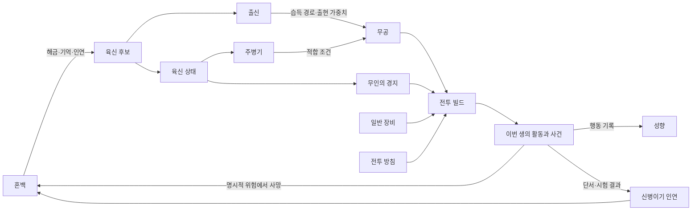

# 성장 및 전투 시스템 설계

> 문서 상태: 코어 설계 기준선
> 관련 문서: [핵심 게임 설계](CoreGameDesign.md), [데이터 아키텍처 초안](../Technical/DataArchitectureDraft.md), [코어 시스템 마이그레이션 계획](../Roadmap/CoreSystemMigrationPlan.md)

## 1. 시스템 관계

이번 생의 성장과 혼백의 영구 성장은 분리하되, 영구 성장이 다음 생의 선택 폭을 넓히도록 연결한다.

## 2. 수명별 소유권

| 데이터 | 이번 생 | 혼백 영구 | 원칙 |
| --- | --- | --- | --- |
| 육신 개체와 부상 | 유지 | 소실 | 사망 시 종료 |
| 출신 | 유지 | 출신 해금·정보만 유지 | 다음 생의 육신 후보를 통해 다시 결정 |
| 주병기 선택과 현생 병기 경험 | 유지 | 병기 경험 일부 유지 | 다음 생에 병기 재선택 가능 |
| 개별 무공 습득·숙련 | 유지 | 기억 또는 시작 경로만 일부 유지 | 무공별 계승 규칙 적용 |
| 무인의 경지 | 유지 | 전생 최고 기록·정보만 유지 | 새 육신은 시작 경지에서 재성장 |
| 일반 장비·재료 | 대부분 유지 | 대부분 소실 | 사망 규칙에 따라 결산 |
| 신병이기 실물 | 유지 가능 | 실물은 소실 가능 | 단서·인연·시험·각인은 혼백에 유지 |
| 성향 | 생의 행동으로 변화 | 전생 기록·평판 단서 유지 가능 | 새 육신의 성향을 강제하지 않음 |
| 자동 행동 규칙 | 사용 | 해금·사용자 설정 유지 | 영구 성장의 핵심 보상 |

## 3. 육신과 출신

### 육신

육신은 한 생의 가변 상태를 담는 그릇이다.

- 고유 후보 ID와 표시 이름
- 기본 체력, 내력, 근력 등 시작 능력치
- 부상, 상태 이상, 현재 자원
- 이번 생의 경지, 무공, 장비, 인벤토리
- 출신 ID와 주병기 ID
- 성향과 관계 상태

현재 `Assets/Scripts/Data/PlayerData.cs`가 이 책임 대부분을 한 클래스에 담고 있다. 목표 구조에서는 저장·시뮬레이션 가능한 `LifeState`와 전투용 계산 결과를 분리한다.

### 출신

출신은 단순 능력치 패키지가 아니라 콘텐츠 경로 조정자다.

- 시작 능력치와 성장 성향
- 무공, 병기, 장비의 습득 난이도 보정
- 사건, 스승, 문파, 인연의 출현 가중치
- 시작 정보와 선택지
- 성향의 초기 경향값

출신이 달라도 대부분의 병기와 무공을 영구 금지하지 않는다. `금지`보다 비용 증가, 선행 사건, 우회 스승, 비급 탐색 같은 다른 경로를 우선한다. 세계관상 절대 제한이 필요한 소수 콘텐츠만 명시적 금지 조건을 사용한다.

현재 `Assets/Scripts/Data/BodyOriginData.cs`와 `ReincarnationManager.CreateCandidatePool()`은 육신·출신을 하나의 능력치 패키지로 고정 생성한다. 기존 세 출신인 검문 제자, 마교 잡역, 약밭 견습은 수직 슬라이스의 출신 정의로 옮길 수 있다.

### 성향

의협, 냉혹, 신의는 상호 배타적인 직업이 아니라 행동 누적으로 형성되는 축이다.

- 사건 선택에는 하나 이상의 성향 변화량이 붙는다.
- 성향은 사건 가중치, NPC 반응, 습득 경로와 보상 변형에 사용한다.
- 출신은 초기 경향을 줄 수 있으나 최종 성향을 고정하지 않는다.
- 한 번의 선택으로 대규모 콘텐츠가 영구 봉쇄되지 않도록 임계값과 회복 경로를 둔다.

## 4. 병기

병기 선택은 이번 생의 직업 선택 역할을 한다. 지원 구조는 다음 계열을 수용한다.

1. 검
2. 도
3. 창·극
4. 봉·곤
5. 권법·장법
6. 암기
7. 철선·기문병기
8. 편·사슬병기

규칙은 다음과 같다.

- 새 육신에서 주병기를 다시 선택할 수 있다.
- 병기 계열은 사용 가능한 전용 무공, 전투 거리·속도·자원 규칙, 장비 태그에 영향을 준다.
- 병기 경험 일부는 혼백에 남아 다음 생의 시작 선택지나 습득 보정으로 전환된다.
- 다른 계열 병기를 획득할 수는 있으나, 주병기 변경 비용과 무공 적합성 규칙을 적용한다.
- 초기 구현은 검 계열의 획득·장착·전투·무공 상호작용을 끝까지 완성한다. 다른 계열은 ID와 데이터 계약만 수용하고 실제 콘텐츠는 만들지 않는다.

## 5. 무공

### 분류

| 분류 | 병기 요구 | 예시 | 규칙 |
| --- | --- | --- | --- |
| 병기 전용 무공 | 적합 병기 필요 | 검법, 도법, 창법 | 주병기·장착 병기 적합성 검사 |
| 공통 보법 | 없음 | 회류보 | 이동, 회피, 안전 귀환 등에 영향 |
| 공통 심법 | 없음 | 내공 운용 | 내력, 회복, 돌파 준비에 영향 |
| 공통 외공 | 없음 또는 태그 조건 | 신체 단련 | 체력, 방어, 특정 병기 보조 |

현재 무공의 목표 분류는 다음과 같다.

- `청풍검식`: 검 계열 병기 전용 검법
- `파문검식`: 검 계열 병기 전용 검법
- `회류보`: 병기와 무관한 공통 보법

현재 `FirstFormSkillType`은 회류보와 두 검법을 같은 닫힌 enum에 넣고, `BattleManager`가 타입별 효과를 직접 분기한다. 목표 구조에서는 분류, 병기 적합성, 효과와 습득 조건을 데이터와 효과 처리기로 분리한다.

### 습득 조건

무공 습득 가능 여부는 다음 조건의 조합으로 평가한다.

- 현재 또는 선택 병기 계열
- 출신과 성향
- 무인의 경지
- 선행 무공과 해당 숙련 단계
- 사건 완료, 스승과 인연, 문파 상태
- 비급 또는 단서 보유
- 혼백이 해금한 전생 정보

조건 결과는 `가능/불가능`만 반환하지 않고 `발견 가능`, `수련 가능`, `효율 저하`, `대체 경로 존재`를 표현할 수 있어야 한다.

### 개별 무공 숙련

모든 무공은 별도의 숙련 상태를 가진다.

1. 입문
2. 소성
3. 대성
4. 극성

무공 숙련은 **무인의 경지와 별개**다. 예를 들어 일류 초입 무인이 청풍검식을 입문 상태로 새로 배울 수 있다. UI, 저장, 로그에서도 `경지`와 `무공 숙련`이라는 용어를 섞지 않는다.

## 6. 무인의 경지

무인의 경지는 6개 대경지와 각 3개 소경지로 총 18단계다.

| 순서 | 대경지 | 소경지 |
| --- | --- | --- |
| 0~2 | 삼류 | 초입 → 완숙 → 극 |
| 3~5 | 이류 | 초입 → 완숙 → 극 |
| 6~8 | 일류 | 초입 → 완숙 → 극 |
| 9~11 | 절정 | 초입 → 완숙 → 극 |
| 12~14 | 초절정 | 초입 → 완숙 → 극 |
| 15~17 | 화경 | 초입 → 완숙 → 극 |

### 상승 규칙

- 같은 대경지 안의 `초입 → 완숙 → 극`은 진척 조건을 채우면 자동 또는 간단한 확인으로 오른다.
- `극 → 다음 대경지 초입`만 대경지 돌파다.
- 대경지 돌파 조건을 충족하면 진행을 강제로 중단하지 않고 중대 사건을 보관한다.
- 돌파 시도는 접속 중 플레이어가 직접 시작하며, 실패 결과와 사망 가능 여부를 사전에 표시한다.
- 화경 극 이후의 확장은 이 설계 범위 밖이며, 18단계의 의미를 바꾸지 않고 별도 체계로 추가한다.

### 구형 경지 호환

기존 `RealmLevel.Initiate/Tempered/Skilled`는 새 경지 이름으로 재사용하지 않는다. 구형 저장의 진행 순서를 보존하기 위한 임시 읽기 매핑은 다음과 같다.

| 구형 값 | 임시 새 단계 |
| --- | --- |
| Initiate / 입문 | 삼류 초입 |
| Tempered / 단련 | 삼류 완숙 |
| Skilled / 숙련 | 삼류 극 |

이 매핑은 구형 저장을 읽을 때만 적용하며, 기존 enum·저장값을 이 문서 작업에서 변경하지 않는다. 실제 전환은 버전 마이그레이션과 백업을 갖춘 뒤 수행한다.

## 7. 장비

### 기본 슬롯

- 주병기
- 방어구
- 신법구
- 장신구

`신법구`는 보법이라는 무공 분류와 구분되는 장비 슬롯이다. 보법 효과를 증폭하거나 이동·귀환·회피 규칙을 바꾸는 물건을 장착한다.

### 장비 설계 규칙

- 일반 장비는 이번 생의 빌드 자산이며 사망 시 대부분 소실된다.
- 단순 공격력 우위보다 무공, 병기, 출신, 성향, 전투 방침과의 태그 조합을 우선한다.
- 장비는 정의와 개체를 분리한다. 같은 정의라도 품질, 부가 효과, 내구 상태, 귀속이 다를 수 있다.
- 자동 장착은 점수 하나로 최고 공격력을 고르는 기능이 아니라 사용자가 저장한 우선순위와 금지 규칙을 평가한다.
- 보관·분해 규칙은 희귀도, 태그, 새 도감 등록 여부, 현재 빌드 적합성, 잠금 상태를 조건으로 사용할 수 있어야 한다.
- 오프라인 중 장착 장비나 잠금 장비를 자동 분해하거나 파괴하지 않는다.

현재 `ItemData`, `RunInventoryData`, `LootItemCatalog`는 ID와 중첩 수를 저장하는 좋은 최소 패턴을 제공하지만, 장비 슬롯·개체·태그·자동 규칙이 없고 효과가 `PlayerData`에 직접 적용된다.

## 8. 신병이기

신병이기는 일반 장비의 최고 희귀도가 아니라 여러 생에 걸친 독립 장기 목표다.

각 신병이기는 다음 데이터를 가진다.

- 안정적인 고유 ID와 고유 이름
- 유래와 발견 가능한 단서
- 전용 효과와 사용 조건
- 계약 또는 소유 시험
- 사용 반동과 실패 결과
- 각성 단계와 조건
- 인연 및 각인 규칙

상태는 두 층으로 분리한다.

- **실물 상태**: 현재 생에서 소유·장착한 병기, 현재 각성·손상 상태. 사망 시 잃을 수 있다.
- **혼백 인연 상태**: 발견 단서, 만난 인연, 완료한 시험, 각인, 알려진 반동. 생이 끝나도 남는다.

시험과 계약은 중대 사건이므로 오프라인에서 자동 실행하거나 확정하지 않는다. 검 수직 슬라이스에서는 실제 신병이기 콘텐츠를 추가하지 않고 데이터 계약과 저장 확장점만 검증한다.

## 9. 혼백 성장

혼백은 전생의 모든 수치를 그대로 복사하는 장치가 아니라 새 경로를 여는 메타 진행이다.

우선순위는 다음과 같다.

1. 새로운 출신과 육신 후보군
2. 병기 계열과 병기별 시작 선택지
3. 사건·스승·비급에 대한 사전 정보
4. 자동 행동, 귀환, 장착, 보관, 분해 규칙
5. 신병이기 단서·인연·시험 기록
6. 제한적인 병기 경험과 전생 기억
7. 보조적인 시작 능력치 보정

현재 `SoulGrowthData`의 혼의 맷집, 잔류 검의, 맑은 내력 레벨과 이미 획득한 포인트는 구형 저장 호환 대상으로 보존한다. 새 해금 중심 트리에 환산할지는 별도 밸런스 결정이 필요하며, 초기 마이그레이션에서 임의로 소거하거나 재화로 자동 변환하지 않는다.

## 10. 전투

### 일반 전투

- 활동 계획이 허용한 적과 위험도 안에서 자동 진행한다.
- 전투 방침과 현재 빌드에 따라 행동을 선택한다.
- 체력·내력·소모품·부상 임계값을 넘으면 자동 귀환한다.
- 짧은 입력 창에 반응하지 않았다는 이유로 불리한 치명 결과를 주지 않는다.
- 접속 중 수동 개입은 더 나은 효율이나 연출을 줄 수 있지만 필수는 아니다.

### 위험 전투

- 생사결, 강적 추적, 신병 시험 등은 일반 전투 큐에 섞지 않는다.
- 위험·보상·철회 가능 시점을 확인하고 직접 시작한다.
- 사망 가능 여부와 보존·소실 항목을 시작 전에 표시한다.
- 도중 앱 종료, 중복 실행, 저장 실패에 대한 체크포인트 규칙을 가진다.

### 계산 책임

전투 계산은 다음 단계로 나눠 추적 가능하게 만든다.

1. 육신 기본 능력과 경지
2. 주병기와 병기 경험
3. 활성 무공과 개별 숙련
4. 장비·출신·성향 시너지
5. 전투 방침과 자동 행동 규칙
6. 적 전법, 환경, 위험도
7. 최종 피해·소모·부상·전리품 결과

현재 `BattleManager.CalculatePlayerAttackDamage()`의 세부 피해 내역은 진단 가능성 측면에서 유지할 가치가 있다. 반면 `FirstFormSkillType`, 출신 이름 문자열, `LootItemCatalog` ID와 `RealmLevel.Skilled`를 직접 분기하는 부분은 데이터 기반 조건·효과 평가기로 교체한다.

## 11. 시스템 불변 조건

- 무공 숙련 4단계와 무인의 경지 18단계를 같은 필드나 enum으로 표현하지 않는다.
- 콘텐츠 참조는 표시 이름이 아닌 안정적인 ID를 사용한다.
- 출신은 일반 병기·무공을 기본적으로 완전 금지하지 않는다.
- 새 육신에서 주병기를 다시 선택할 수 있다.
- 오프라인 정산은 사망, 대경지 돌파, 문파 선택, 신병 계약을 확정하지 않는다.
- 일반 장비와 신병이기는 같은 희귀도 사다리나 저장 수명 규칙을 사용하지 않는다.
- 혼백 영구 성장의 주 보상은 해금·정보·자동화이며 무제한 직접 전투력 누적이 아니다.
