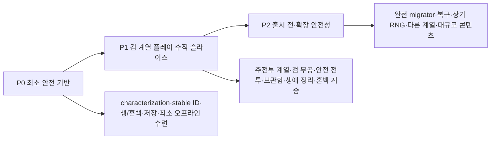

# 코어 시스템 마이그레이션 계획

> 문서 상태: 검토 중인 마이그레이션 계획 초안
> 목표: 현재 프로토타입의 플레이 감각과 저장 데이터를 보존하면서 무협 회귀형 방치 로그라이트 구조로 단계적으로 전환한다.
> 전제: 기존 경지 데이터와 legacy 저장은 검증된 importer가 안정화될 때까지 삭제하지 않는다.
> 이번 문서 PR: 게임 코드·저장 형식·UI·콘텐츠를 변경하지 않는다.

## 1. 전환 전략

한 번에 재작성하지 않는다. 구현 순서는 출시 게이트인 P0/P1/P2로 관리하고, 각 우선순위 안의 작업도 저장·도메인·UI 책임에 따라 더 작은 PR로 나눈다.

1. 현재 동작을 테스트와 fixture로 먼저 고정한다.
2. 새 구조를 legacy 어댑터 뒤에 병렬 도입한다.
3. 동일 입력에 구·신 결과를 비교한다.
4. P0에서는 현재 원본 저장 백업, 최소 version 판별과 revision/checkpoint를 우선하고 존재하지 않는 버전을 추정해 구현하지 않는다.
5. P1은 검 주전투 계열의 실제 사용자 흐름이 한 생의 시작부터 사망 또는 생애 정리와 다음 생까지 연결되어야 완료된다.
6. P0에서 단일 backup, 분리된 shadow-write, 의미·재로드 검증 뒤 활성화하는 최소 안전 절차를 갖춘다. 다중 backup, downgrade 충돌 사본, 장기 feature flag와 rollback은 P2에서 출시 수준으로 강화한다.
7. legacy reader와 원본 저장은 안정화 릴리스가 지난 뒤에만 제거를 검토한다.

## 2. P0/P1/P2 우선순위별 계획

| 우선순위 | 목표 | 사용자 체감 게이트 |
| --- | --- | --- |
| P0 — 최소 안전 기반 | 기존 플레이와 원본 저장을 잃지 않고 새 상태·ID·checkpoint를 도입 | 현재 플레이 유지 + 최소 오프라인 수련이 정확히 한 번 정산됨 |
| P1 — 검 계열 플레이 수직 슬라이스 | 새 방향의 한 생 전체 루프를 실제 UI와 저장으로 플레이 가능하게 연결 | 검 선택부터 사망 또는 생애 정리, 혼백 계승과 다음 생 영향까지 확인 |
| P2 — 출시 전·확장 안전성 | 장기 호환·복구·rollback과 다른 콘텐츠 계열을 출시 수준으로 강화 | 다세대 저장·대규모 콘텐츠·장기 운영 실패를 복구 가능 |

P1 명칭의 `검 계열`은 검 주전투 계열을 중심으로 검 병기 계열의 장착 병기와 검법을 연결하는 최소 범위를 줄여 부른 것이다. 데이터와 규칙에서는 세 개념을 각각 `CombatDiscipline`, `WeaponFamily`, `EquipmentInstance`로 구분한다.

### P0 — 최소 안전 기반

P0는 기존 플레이를 무너뜨리지 않으면서 현재 생을 재로드하고 최소 오프라인 수련을 중복 없이 정산할 수 있는 가장 작은 기반이다. 아래 하위 항목은 각각 별도 구현 PR로 제출할 수 있다.

#### P0.1 현재 동작과 저장 형식 기준선

**기준선 산출물:** [P0.1 현재 동작과 저장 형식 기준선](../Technical/P0_1CharacterizationBaseline.md)

**구현**

- EditMode/PlayMode 테스트 assembly를 추가한다.
- 현재 `SaveData.version = 3`의 실제 wire shape를 `v3-loot` golden JSON으로 고정한다.
- Git 이력에서 확인된 `9fa3e3c`의 `v1-initial`, `4368487`의 version 값이 같은 `v1-with-soul`, `0b08e49`의 `v2-realm`, `a1a2884`의 `v3-loot` 형태를 조사 fixture로 남긴다. 같은 v1 두 형태는 필드 존재 여부로 구분한다.
- Git 이력상 스키마 존재와 실제 배포·실사용 저장 표본 존재를 구분한다. 배포 근거나 원본 표본을 확인하지 못한 형태는 자동으로 지원 대상으로 확정하지 않는다.
- `GameManager`의 무공 선택 → 수련 → 출행 → 전투 → 승리/사망 → 육신 선택 흐름을 characterization test로 고정한다.
- 현재 세 무공, 세 출신, 다섯 아이템, 세 경지의 결과를 스냅샷화한다.
- `SampleScene.unity`의 `FirstFormGameState` 직렬화 값과 주요 inspector 참조를 기록한다.

**완료 조건**

- main 기준 현재 플레이 루프와 저장 로드 결과가 자동 테스트로 재현된다.
- 손상 JSON, 비어 있는 필드, 알 수 없는 아이템 ID, 사망 직후 저장의 현재 동작이 fixture로 남는다.
- 테스트 실패 없이 이후 단계의 refactor를 시작할 수 있다.

**주요 위험**

- Git 이력만 보고 실제 배포 범위를 단정하거나 동일 version의 다른 wire shape를 하나로 오인할 수 있다.
- 씬 enum ordinal과 런타임 상태를 함께 고정하지 않으면 enum 확장 때 시작 상태가 달라질 수 있다.

#### P0.2 안정 ID, legacy alias와 콘텐츠 카탈로그

**구현 산출물:** [P0.2 안정 ID, legacy alias와 콘텐츠 카탈로그](../Technical/P0_2StableIdContentCatalog.md)

**구현**

- `GameContentCatalog`와 ID 중복·누락 검증기를 추가한다.
- 기존 세 출신, 세 무공, 다섯 아이템, 적·사건을 정의 데이터로 표현한다.
- legacy 이름과 enum ordinal을 stable ID로 바꾸는 alias 표를 추가한다.
- 기존 매니저는 어댑터를 통해 새 정의를 읽되 현재 수치와 결과를 유지한다.
- `CombatDiscipline`, `WeaponFamily`, `EquipmentInstance`의 ID 책임을 분리한다. 다른 7개 주전투 계열은 ID 계약만 정의하고 실제 콘텐츠·효과나 사용자 선택 UI를 만들지 않는다.

**완료 조건**

- 표시 이름을 바꿔도 저장 ID와 전투 판정이 변하지 않는다.
- 중복 ID, 끊어진 참조, 잘못된 검법 병기 조건이 에디터 또는 CI 검증에서 실패한다.
- 기존 프로토타입의 수치와 무공 효과가 characterization test와 동일하다.

**주요 위험**

- Unity asset GUID를 stable ID로 오인하는 문제
- legacy `LootItemCatalog`와 새 정의 효과가 동시에 적용되는 문제
- 현재 전투의 출신 이름 문자열 분기를 태그로 옮길 때 상성 변화가 생기는 문제

#### P0.3 `LifeState`/`SoulState`와 파생 능력치 분리

**구현 산출물:** [P0.3 LifeState/SoulState와 파생 능력치 분리](../Technical/P0_3LifeSoulState.md)

**구현 현황:** 현재 플레이와 `SaveData.version = 3` wire를 권위 있는 호환 경로로 유지한 채 `SoulState`, `LifeState`, 생 통계와 session/view state를 런타임에 분리한다. `PlayerData`는 `LegacyPlayerFacade`로 남고 새 능력치 계산은 적용하지 않는 shadow 비교로 연결한다. 현재 생 핵심 상태의 영속화, 새 DTO·mapper·repository와 재접속 가능한 `lifeId`는 P0.4 범위다.

**구현**

- `SoulState`, `LifeState`, 생 통계, session/view state를 분리한다.
- `SoulUnlockState`와 `UnlockEligibilityService`를 추가해 출신·주전투 계열·사건 정보·자동 규칙·시작 선택지 해금을 직접 능력치와 분리한다.
- 현생 무공의 `MartialArtProgressState`와 혼백의 `MartialArtDiscoveryState`·`MartialArtUnlockState`·`MartialArtMemoryState` 계약을 분리하되 P0에서는 기존 플레이 결과를 바꾸지 않는다.
- 생 한정 `DispositionState`에 의협·냉혹·신의 축을 저장한다.
- `PlayerData`를 즉시 제거하지 않고 `LegacyPlayerFacade`로 구·신 상태를 연결한다.
- `StatAggregationService`를 shadow mode로 실행해 현재 직접 가감 결과와 비교한다.
- 육신 개체와 `OriginDefinition`을 분리하고 첫 생도 후보 선택을 거치게 할 준비를 한다.
- `RunData.currentRun`의 의미를 생 번호로 고정한다.

**완료 조건**

- 같은 출신·경지·무공·아이템 입력에서 구·신 최대 체력, 내력, 공격, 피해 감소 결과가 허용 오차 안에서 같다.
- 혼백 상태는 단일 원본이고 `PlayerData` 복제본과 수동 동기화하지 않는다.
- legacy 혼백 직접 스탯을 그대로 보존하면서 해금 상태와 조건 평가가 런타임에서 독립적으로 유지된다. legacy JSON round-trip 결과는 바뀌지 않는다.
- 성향 값은 `LifeState`에만 속하고 혼백 상태로 자동 복사되지 않는다. 성향의 영속화는 P0.4 저장 경계에서 다룬다.
- 생이 끝나기 전에는 앱 재시작만으로 생 번호가 증가하지 않는다.

**주요 위험**

- 기존 `ApplyBodyOrigin`, `RestoreRealmProgress`, `RestoreRunInventory`와 새 합성기가 보너스를 이중 적용
- 현재 체력을 파생 최대 체력보다 먼저 복원해 clamp되는 문제
- first life의 “평범한 육신” fallback이 사라지며 새 게임이 막히는 문제

#### P0.4 현재 생 핵심 저장, 원본 백업과 최소 version 판별

**구현**

- 현재 `SaveData.version = 3` DTO를 legacy 입력으로 동결하고, Git 이력에서 확인한 v1 두 형태와 v2는 필드 기반 판별 대상으로 기록한다.
- 현재 형식을 읽는 최소 legacy mapper, `ISaveStore`, `SaveRepository` 경계를 추가한다. 실제 배포·fixture가 확인되지 않은 저장 세대의 DTO나 migrator를 추측해 만들지 않는다.
- 구형 `PlayerPrefs` 원문과 key를 첫 변환 전에 별도 backup으로 보존하며 원본 key를 새 저장으로 덮어쓰지 않는다.
- stable ID 매핑, 구형 경지 명시 매핑, 구형 무공 매핑을 적용한다.
- 알 수 없는 ID를 `UnresolvedReference`로 격리한다.
- 활성 생의 `lifeId`, 생 번호, 출신, 현재 자원, 경지 사이 진척, 현생 무공, 현재 스택형 인벤토리, 최소 활동 계획과 마지막 수련 checkpoint를 저장·재로드한다. 새 장비 loadout과 장착 instance는 P1.6까지 비어 있는 확장점으로만 둔다.
- `SoulState`에는 기존 혼백 포인트와 세 성장 레벨을 손실 없이 보존한다.
- save revision과 checkpoint sequence를 저장하고 expected revision이 일치할 때만 정산 결과를 commit한다.
- legacy 원문 hash와 최소 import provenance를 기록해 같은 원문과 같은 수련 구간을 중복 처리하지 않는다.
- 지원 버전보다 높은 schema는 fail-closed하며 원문을 유지하고 쓰기를 거부한다.
- 새 최소 저장은 legacy 원본과 다른 key 또는 파일에 shadow-write하고 의미 검증과 실제 재로드 검증을 모두 통과한 뒤에만 활성 저장으로 승격한다. P0에서는 원본 외 단일 복구 backup을 보장한다.
- pause/quit/checkpoint 저장 정책을 추가한다.

**완료 조건**

- `v3-loot` golden fixture가 새 최소 포맷으로 변환되고 재로드 round-trip 후 생 번호, 출신, 무공, 경지, 아이템, 혼백이 보존된다.
- 지원 대상으로 확정한 역사적 fixture가 있다면 `v1-initial`, `v1-with-soul`, `v2-realm`을 서로 다른 wire shape로 판별하며 version 숫자만으로 분기하지 않는다.
- 수련 도중 저장·재접속해도 같은 육신의 현재 자원, 경지 사이 진척과 현생 무공 상태가 이어진다.
- migration 실패를 주입해도 구형 원문이 남고 이전 저장으로 복구된다.
- shadow 저장의 의미 검증이나 재로드 검증을 실패시키면 활성 저장이 바뀌지 않고, 두 검증을 통과한 경우에만 한 번 승격된다.
- `SaveData.Sanitize()`가 새 migration 입력의 미등록 item을 삭제하는 경로가 차단된다.
- 같은 checkpoint와 revision을 다시 제출해도 저장이나 보상이 중복 적용되지 않는다.

**주요 위험**

- `SaveData.version = 3`과 key 이름 `v1`을 혼동해 잘못된 DTO를 선택
- version 값이 같은 `v1-initial`과 `v1-with-soul`을 하나로 간주
- 구형 저장에 애초에 없는 수련 진척을 복원했다고 잘못 간주
- 현생 핵심 상태를 한 번에 넓게 추가해 어떤 필드가 원본인지 불명확해짐

**롤백**

- 새 최소 저장 read 경로를 끄고 보존한 구형 원본으로 재개한다.
- 새 저장 파일과 legacy `PlayerPrefs` key를 서로 덮어쓰지 않는다. P0의 단일 backup·shadow-write·검증 후 승격 경로를 유지하며, P2에서 다중 backup과 장애 복구 UI를 강화한다.

#### P0.5 최소 오프라인 수련 정산

**구현**

- 현재 `TrainingManager` 수련 공식 하나를 순수 계산 함수로 분리하고 저장된 마지막 수련 checkpoint부터 경과 시간을 정산한다.
- P0에서는 수련만 대상으로 하며 일반 전투, 사건, 제작·채집과 범용 RNG 호환은 아직 활성화하지 않는다.
- 정산 결과와 새 checkpoint/revision을 한 번에 저장한 뒤 결과를 표시한다.
- 비정상 시계 역행은 0으로, 경과 시간은 임시 설정 상한으로 제한한다.

**완료 조건**

- 같은 시작 상태와 경과 시간에는 같은 수련 진척을 산출한다.
- 정산·보고 중 종료 후 재접속해도 같은 시간 구간의 진척이 한 번만 적용된다.
- 최소 오프라인 수련은 육신 사망, 대경지 돌파, 사건 선택이나 생애 정리를 자동 확정하지 않는다.

**주요 위험**

- 실시간 `Update()`와 로그인 정산이 같은 시간을 두 번 처리
- P1에서 범용 활동 서비스를 도입할 때 P0 전용 계산이 두 번째 영구 경로로 남음

### P1 — 검 계열 플레이 수직 슬라이스

P1은 내부 모델만 존재하는 단계가 아니다. 사용자가 실제 UI에서 검 주전투 계열을 선택하고 안전한 오프라인 진행, 보관 사건, 위험 행동 또는 생애 정리, 혼백 계승이 다음 생 선택에 미치는 영향까지 플레이할 수 있어야 한다. P1의 하위 항목도 기능별 작은 PR로 나눈다.

#### P1.1 무인의 경지

**구현**

- 삼류, 이류, 일류, 절정, 초절정, 화경과 초입·완숙·극의 18단계 정의를 추가한다.
- legacy `RealmLevel`은 ordinal을 동결하고 `LegacyRealmAdapter` 뒤에 둔다.
- `Initiate → 삼류 초입`, `Tempered → 삼류 완숙`, `Skilled → 삼류 극`을 명시적으로 적용한다.
- 소경지 진척·상승과 대경지 돌파 가능 상태를 분리한다.
- 대경지 조건 충족은 UI 강제 전환 대신 P1.5의 최소 사건 보관함에 decision command를 생성한다. P1.1 PR에서는 그 command를 저장할 작은 호환 계약만 먼저 추가할 수 있다.

**완료 조건**

- 검 수직 슬라이스에서 삼류 초입 → 완숙 → 극이 자동 진행된다.
- 삼류 극에서 이류 초입으로는 자동 상승하지 않고 돌파 가능 항목이 저장된다.
- 재접속, 저장 재로드, 콘텐츠 밸런스 변경 뒤에도 현재 단계와 보너스가 중복 적용되지 않는다.
- headless test와 legacy debug adapter가 `무인의 경지: 삼류·완숙`과 `무공 숙련: 소성`을 구분한다. P1 완료 전에는 P1.7 사용자 화면에서도 같은 구분을 확인한다.

**주요 위험**

- 기존 enum 재정렬로 씬·저장 ordinal 오독
- 로드할 때 돌파 보너스를 매번 누적
- 기존 검법 요구치를 모든 병기의 공통 조건으로 고착

#### P1.2 주전투 계열, 장착 병기와 현생 무공

**구현**

- 새 생의 `primaryCombatDisciplineId` 선택 흐름을 추가한다.
- `CombatDisciplineDefinition`, `WeaponFamilyDefinition`, `EquipmentInstance`의 책임을 분리한다. 검 주전투 계열과 검 병기 계열의 장착 적합성 검사기를 구현하고, P1.6 전까지 사용할 최소 `MainWeapon` 계약 또는 `LegacySwordProxy`를 제공한다.
- 청풍검식·파문검식을 검 전용, 회류보를 공통 보법으로 옮긴다.
- 현생 무공별 입문·소성·대성·극성 `MartialArtProgressState`를 추가한다.
- 혼백의 `MartialArtDiscoveryState`, `MartialArtUnlockState`, `MartialArtMemoryState`를 현생 무공과 분리한다.
- `EligibilityService`가 주전투 계열, 장착 병기, 출신, 경지, 선행 무공, 사건, 스승, 비급 조건과 대체 경로·비용을 평가하고 습득 가능성과 사용 가능성을 분리한다.
- legacy 단일 무공은 활성 생의 현생 무공과 무공 발견으로 가져온다. 시작 무공 해금이나 무공 기억은 근거 없이 자동 생성하지 않는다.
- 사용자 선택 UI에는 구현된 검 주전투 계열만 표시하며 다른 7개 계열을 잠금·비활성 카드로 노출하지 않는다.

**완료 조건**

- `primaryCombatDisciplineId = combat_discipline.sword`와 검 병기 계열의 장착 병기를 모두 충족하지 않으면 검법은 발견·해금되어 있어도 발동하지 않는다.
- 회류보는 병기와 무관하게 조건을 충족하면 사용할 수 있다.
- 두 출신이 같은 검 무공을 완전 금지하지 않으면서 서로 다른 습득 경로 또는 비용을 반환한다.
- 무공 숙련이 저장·재로드되고 경지 단계와 독립적으로 변한다.
- 다른 주전투 계열이나 병기 계열을 추가할 때 전투 핵심 코드를 복사하지 않고 정의와 효과 처리기만 추가할 수 있다.
- 이 단계의 흐름은 headless test와 legacy debug adapter로 먼저 검증하고 P1.7의 사용자용 육신→주전투 계열→현생 무공 화면에서 활성화한다.

**주요 위험**

- `swordMastery`를 현생 무공 숙련과 주전투 계열 경험 양쪽에 중복 이관
- 기존 `firstFormSkill`을 먼저 제거해 구형 저장의 전투 효과 유실
- 검 수직 슬라이스 편의를 위해 새 `PlayerData`에 다시 검 전용 필드를 추가

#### P1.3 활동 계획과 결정론적 시뮬레이션

**구현**

- `ActivityPlanState`, `CombatPolicyState`, `SafetyPolicyState`, `LootPolicyState`를 추가한다.
- `ActivityType`/`ActivityDefinition`이 수련, 회복, 제작, 채집, 일반 전투를 같은 체크포인트·결정론 계약으로 표현하게 한다. 수직 슬라이스의 제작·채집은 fixture 정의와 저장·정산 계약만 검증한다.
- `TrainingManager`의 수련 공식을 순수 `ActivitySimulationService`로 옮긴다.
- 회복과 안전한 일반 전투를 같은 시간 구간 계약으로 처리한다.
- 정수 simulation tick, 고정 알고리즘의 counter-based `IRandomSource`, 저장된 seed/sequence/나머지 tick/algorithm version을 사용한다.
- 온라인 `Update()`는 같은 서비스를 짧은 구간으로 호출하는 어댑터가 된다.
- 온라인 tick과 오프라인 정산의 동시·중복 적용을 막는다.
- 이 하위 단계에서는 headless 비교만 수행하고 실제 오프라인 보상과 자동 일반 전투는 P1.4 안전 경계를 통과하기 전 활성화하지 않는다.

**완료 조건**

- 같은 시작 상태·활동 계획·전투 방침·seed와 동일한 자동 command stream에서 온라인 구간 실행과 오프라인 일괄 실행 결과가 같다. 수동 command가 있으면 입력 차이로 기록한다.
- 활동 목적, 위험도, 귀환 임계, `Adaptive/Defensive/Aggressive` 방침이 저장된다.
- 제작·채집 fixture가 다른 활동과 같은 checkpoint와 중복 방지 계약으로 저장·정산된다.
- 시스템 시계 역행은 0초, 비정상 공백은 설정 상한으로 처리한다.
- 정산 성능이 지원할 최대 오프라인 기간에서 허용 범위 안이다.

**주요 위험**

- `Update()`와 로그인 정산이 같은 시간을 두 번 처리
- 프레임 기반 Random 호출 순서 차이로 결과가 재현되지 않음
- 긴 공백을 작은 틱으로 그대로 반복해 성능 저하

#### P1.4 부재 안전 정산과 접속 결과 보고

**구현**

- `SafetyBoundaryService`로 일반 자동 행동의 치명 결과를 귀환·부상·제한 손실로 바꾼다.
- 정산 결과와 새 체크포인트를 먼저 원자 저장한 뒤 보고서를 표시한다.
- 보고서에 경과 시간, 획득·소모, 진척, 부상, 귀환, 손실, 중단 사유를 기록한다.
- 직접 시작한 위험 행동은 오프라인으로 자동 판정하지 않는다. 앱 종료 시 시도 전이 아니라 이미 원자 저장된 동일 위험 행동 attempt 상태에서 멈춘다.
- 이 하위 단계의 안전 property test가 통과한 뒤에만 P1.3 시뮬레이터의 실제 오프라인 보상과 자동 일반 전투를 활성화한다.

**완료 조건**

- 자동 수련·회복·일반 전투로 육신이 사망하는 테스트가 0건이다.
- 보고 화면에서 앱을 종료하고 다시 열어도 보상이 중복되지 않는다.
- 자동 귀환과 전리품 손실이 사용자가 저장한 범위를 넘지 않는다.
- 장착·잠금 장비, 신병 단서, 혼백 상태는 오프라인 손실 대상이 아니다.

**주요 위험**

- 체력 0을 사후에 1로 바꾸기만 해 이미 사망 보상과 생 번호 증가가 적용되는 문제
- 보고 확인 여부를 보상 commit 여부로 사용해 중복 지급
- 안전 정책과 전투 resolver 양쪽에서 귀환 비용을 이중 차감

#### P1.5 사건 보관함, 위험 행동 attempt와 생애 정리

**구현**

- `PendingDecisionState`와 occurrence ID를 저장한다.
- 사건마다 `DecisionScope(Life/Soul/World)`와 `LifeEndDisposition(Discard/ConvertToMemory/CarryOver/ResolveDuringLifeSummary)`을 저장한다.
- 탐험 사건 발생과 선택 해결을 분리한다.
- 기존 사건을 효과 수명에 따라 분류한다. 컨텍스트 독립 사건만 비차단 보관하고, 경로·다음 전투 의존 사건은 해당 출행 분기만 안전 정지하거나 선택 후 최초 적격 전투에 적용되는 저장 토큰으로 변환한다.
- 대경지 돌파, 문파·신병 확장점을 중대 선택으로 분류한다.
- P1의 선택은 검 수직 슬라이스에 필요한 닫힌 allow-list command snapshot만 사용한다. 실제 선택지, 비용·효과, 적용 컨텍스트, 비용 기준, revision, seed를 함께 저장하고 UI 미리보기도 같은 snapshot에서 만든다. 범용·복합 authoritative payload와 versioned content archive는 P2로 미룬다.
- 비용을 발생 시점 상태에 고정하는지 해결 시점 현재 상태에 적용하는지 decision 정의에 명시한다.
- 사건 선택 결과가 생 한정 의협·냉혹·신의 성향을 변경하도록 한다.
- 종류별 생성 cooldown·pending 상한·중복 병합 규칙을 두고, 중대 사건 상한 도달 시 버리지 않고 해당 생성 활동 분기만 안전 중단한다.
- 생 종료 때 생 범위 사건은 기본 폐기하고, 신병이기 단서·전생 지식은 무공 발견이나 혼백 기억으로 변환하며, 명시적 영구 사건만 유지한다. 결과는 생애 결산 화면에 표시한다.
- 위험 행동 시작 전 `attemptId`, definition ID·revision, `lifeId`, 선택 방식, 실제 차감 비용, 고정 seed·sequence, 시작 상태 snapshot, 진행 단계와 결과 적용 여부를 비용 차감과 함께 원자 저장한다.
- 재접속은 같은 위험 행동 attempt를 이어서 처리한다. 비용을 다시 내거나 결과를 다시 추첨하거나 시도 전 상태로 취소할 수 없고, receipt가 있거나 결과 적용 여부가 완료면 두 번 적용하지 않는다.
- `생애 정리` command를 추가한다. 보존·소실·사건 변환·혼백 계승 항목을 보여 주고 직접 확정한 뒤 고유 결산 ID로 한 번만 적용한다. 진행 중 위험 행동 attempt나 중대 사건의 비용·실패를 우회할 수 없다.
- 자연 수명·노화는 P1에서 구현하지 않으며 경지 정체나 장기 생존을 강제 사망 타이머로 사용하지 않는다.

**완료 조건**

- 보관 사건을 처리하지 않아도 안전 활동을 계속할 수 있다.
- 사건이 여러 개 쌓여도 하나도 해결하지 않은 채 결과 확인, 다음 활동 지정과 저장·종료를 완료할 수 있다.
- 같은 정산을 재시도해도 사건이 중복 생성되거나 보상이 재굴림되지 않는다.
- 경로·다음 전투 의존 사건의 적용 대상과 비용 기준이 재접속 뒤에도 유지되고 다른 전투에 잘못 적용되지 않는다.
- 기존 사건 하나의 선택이 성향을 바꾸고 재접속 후 같은 값으로 복원된다.
- 대경지 돌파는 플레이어가 직접 열고 시작하기 전에는 판정되지 않는다.
- 위험 행동 중 종료 후 같은 attempt가 같은 비용·seed·진행 단계로 재개된다.
- 위험 행동 사망 또는 직접 확정한 생애 정리 뒤 생애 결산이 정확히 한 번 실행되고 폐기·변환·유지 항목이 표시된다.
- 중대 사건은 자동 만료·기본 선택으로 확정되지 않는다.

**주요 위험**

- 기존 `ExplorationEventManager.currentEvent`와 새 pending 항목이 동시에 결과 적용
- 최신 콘텐츠 정의로 다시 계산해 보관 중 선택의 비용·보상이 변함
- 선택 해결 저장 전에 UI만 닫혀 항목과 보상 상태가 불일치
- 생애 정리로 위험 attempt나 중대 사건을 삭제해 비용·실패 결과를 우회

#### P1.6 장비와 전리품 정책

**구현**

- 장착 병기, 방어구, 이동 보조 장비 슬롯(가칭: 신법구), 장신구와 장비 instance를 추가한다. 데이터 코드의 `MovementRelic`은 예시 이름이며 최종 사용자 표시명은 별도 결정한다.
- 기존 다섯 아이템은 stable ID를 유지한 legacy 정의로 연결한다.
- 자동 장착·보관·분해 정책을 구현한다.
- 장비 효과를 `StatAggregationService`와 범용 effect resolver가 적용한다.
- 조건부 태그·시너지 resolver가 장비, 현생 무공, 주전투 계열, 병기 계열, 출신, 전투 방침 조합을 평가하고 최종 효과 내역을 진단 가능하게 반환한다.
- 기존 중첩 아이템은 stack을 소비하지 않는 `LegacyEquipmentProjection`으로 표시·적합성만 제공하고 기본 효과는 legacy adapter 한 곳에서만 적용한다. 별도 변환 승인 전에는 projection을 자동 분해하지 않는다.
- 신병이기 실물과 혼백 인연을 분리한 빈 저장 확장점을 검증한다.

**완료 조건**

- 장착 instance와 인벤토리가 저장 round-trip 후 일치한다.
- 잠금, 미등록, 새 도감, 빌드 적합성 규칙이 자동 분해보다 우선한다.
- 일반 장비 생애 결산과 혼백 영구 상태가 분리된다.
- `rusty_sword` 등 legacy stack 효과가 migration 전후 중복되거나 사라지지 않는다.
- 기존 장비 하나가 검 무공 또는 전투 방침과 맺는 조건부 시너지가 fixture에서 발동하고, legacy 기본 효과와 중복 계산되지 않으며 내역에서 근거를 확인할 수 있다.

**주요 위험**

- 현재 누적 효과와 새 장착 효과가 동시에 적용
- 알 수 없는 장비 정의를 inventory validation이 삭제
- 녹슨 검 중첩을 단일 장비 instance로 성급하게 합쳐 수치 손실

#### P1.7 접속 중심 UI 흐름

**구현**

- 홈, 오프라인 결과 보고, 활동 계획, 사건 보관함, 위험 행동 상세, 생애 정리 확인과 생애 결산 화면을 `GameFlowCoordinator`와 view model로 구성한다.
- 고정 3칸 선택 배열을 범용 목록 presenter로 바꾼다.
- 육신 → 주전투 계열 → 시작 무공/활동 계획 흐름을 추가한다. 후보 목록은 플레이 가능한 콘텐츠만 조회하므로 검 수직 슬라이스에서 미구현 7개 계열을 잠금·비활성 버튼으로 표시하지 않는다.
- 육신 후보를 최초 표시하기 전에 후보 ID·출신·표시 순서와 생성 seed를 저장하고, 선택 완료 전 재접속은 같은 후보 snapshot을 재사용한다.
- `UIManager`는 기존 패널 host와 adapter로 축소한다.
- `RuntimeUIBuilder`는 같은 view model을 소비하는 개발용 fallback으로 유지한다.
- 매 프레임 전체 갱신을 이벤트·상태 변경 기반 갱신으로 바꾼다.

**완료 조건**

- 보관 사건의 존재 여부와 관계없이 `오프라인 결과 확인 → 다음 활동 유지 또는 지정 → 저장·종료`만으로 한 접속을 완료할 수 있다.
- 희귀 장비, 새 무공, 중대 사건이 여러 개 쌓여도 하나도 처리하지 않고 홈으로 돌아갈 수 있으며 안전 활동은 계속된다.
- 가변 후보 수와 선택지 수를 코드 배열 길이 변경 없이 표시한다.
- 육신 후보 선택 도중 종료해도 재접속 뒤 후보 ID와 순서가 같으며 후보를 다시 굴릴 수 없다.
- 부분 수동 연결 씬에서도 누락 UI가 명확히 검증되고 조용한 null 실패가 없다.

**주요 위험**

- 새 화면을 `FirstFormGameState` 값만 계속 추가해 다시 단일 전역 상태에 결합
- legacy 패널과 새 router가 동시에 입력을 받음
- Runtime UI와 정식 UI가 서로 다른 규칙을 표시

#### P1.8 검 계열 수직 슬라이스 통합

**구현**

- 아래 최소 범위를 end-to-end로 통합한다.
- legacy reader와 새 저장을 병행 관찰하고 오류·미해결 참조를 수집한다.
- 개발·검증 gate로 P1 흐름을 선택할 수 있게 하되 legacy 원본과 경로를 제거하거나 장기 기본화하지 않는다.
- 하드코딩 카탈로그와 직접 분기의 폐기, 장기 feature flag와 rollback 운영은 P2에서 별도 승인한다.

**완료 조건**

- [4. 수직 슬라이스 인수 조건](#4-검-계열-최소-수직-슬라이스)의 모든 항목을 통과한다.
- 기존 저장에서 가져온 육신·경지·무공·아이템·혼백이 P1 사용자 흐름에서 보존된다.
- 검 선택, 오프라인 안전 성장, 보관 사건 미루기, 생애 정리 또는 직접 시작한 위험 행동의 사망, 혼백 계승이 다음 생 선택에 실제 영향을 준다.
- P1을 여러 작은 PR로 나눠도 각 PR이 이전 저장과 legacy 경로를 읽을 수 있다.

### P2 — 출시 전·확장 안전성

P2는 P1의 플레이 루프가 검증된 뒤 장기 운영과 콘텐츠 확장을 위해 강화하는 범위다. P1 완료를 기다리게 했던 기존 고급 안전 항목은 이 아래로 재배치한다.

**구현**

- 실제 지원 대상으로 확정한 여러 저장 세대에 대해 완전한 migrator chain과 semantic validation을 구현한다. 저장소 이력에 없거나 실제 schema가 확인되지 않은 버전은 만들지 않는다.
- 같은 version의 다른 wire shape와 legacy 원문 hash를 추적하고, 재가져오기·부분 migration·미해결 참조를 관측한다.
- 새 저장을 구버전에서 연 뒤 양쪽 진행이 바뀐 downgrade 상황은 자동 병합하지 않고 충돌 사본으로 보존한다.
- P0의 분리 shadow-write·검증 후 승격을 temp write, flush, 다중 backup, 장애 주입과 복구 UI까지 출시 수준으로 강화한다.
- 복잡한 authoritative decision payload와 해당 revision을 재현하는 versioned content archive를 지원한다.
- 여러 RNG 알고리즘 버전과 콘텐츠 revision을 장기간 호환하고 최대 오프라인 기간, 시계 변조, 대규모 사건 적체를 fuzz·부하 테스트한다.
- feature flag의 점진 활성화, 장기 rollback, 장애 주입과 rollback 빌드의 legacy 원본 읽기를 운영 절차로 검증한다.
- 도, 창·극, 봉·곤, 권법·장법, 암기, 철선·기문병기, 편·사슬병기의 실제 콘텐츠와 대규모 무공·장비·사건을 확장한다.
- 전체 18단계 밸런스, 완성형 제작·채집 경제, 신병이기 시험, 문파·사제·인연 콘텐츠를 후속 제품 범위로 확장한다.
- 안정화 기간과 별도 승인을 통과한 뒤에만 하드코딩 카탈로그, legacy 활성 경로와 reader의 퇴역 일정을 잡는다.

**완료 조건**

- 지원하기로 결정한 모든 실제 저장 fixture가 단계별 migrator chain과 round-trip을 통과한다.
- migration 실패, 미래 schema, downgrade 충돌, 정전·부분 쓰기에서 원본·backup·충돌 사본 중 하나로 복구할 수 있다.
- 오래된 RNG/content version의 미완료 정산·사건·위험 행동 attempt가 재굴림이나 중복 보상 없이 재개된다.
- 다른 주전투 계열 추가가 `PlayerData`, 저장 DTO, UI 고정 배열이나 전투 핵심 분기의 복사를 요구하지 않는다.
- P1 검 주전투 계열 플레이와 legacy 저장을 장기 feature flag 전환·rollback 중에도 보존한다.

**주요 위험**

- 확인되지 않은 저장 버전을 지원한다며 잘못된 데이터를 만들어 냄
- versioned archive와 복잡한 payload가 실제 콘텐츠보다 먼저 커져 유지 비용이 폭증
- rollback 기간이 끝나기 전에 legacy 원본이나 reader를 제거

## 3. 회귀 위험 등록부

| 위험 | 심각도 | 조기 탐지 | 완화 |
| --- | --- | --- | --- |
| legacy item이 `Sanitize()`에서 삭제 | 매우 높음 | unknown ID golden fixture | migration 전 sanitize 금지, 격리 저장 |
| 경지·무공 enum ordinal 오독 | 매우 높음 | 모든 ordinal fixture와 scene 검사 | 기존 enum 동결, 명시 매핑 |
| migration 실패 후 원본 덮어쓰기 | 매우 높음 | 실패 주입·전원 차단 테스트 | backup + shadow + expected revision commit |
| 능력치 보너스 이중 적용 | 높음 | 구·신 stat diff와 연속 reload test | 단일 원본, 합성기 shadow 비교 |
| 실시간·오프라인 이중 정산 | 높음 | checkpoint sequence 중복 테스트 | 단일 revision transaction |
| 일반 자동 전투 사망 | 높음 | 장시간 property/fuzz test | resolver 앞 safety policy, 사망 command 차단 |
| 사건 중복·보상 재굴림 | 높음 | 같은 seed/revision 재시도 | occurrence ID와 권위 있는 효과 payload |
| 위험 행동 종료 재굴림 | 매우 높음 | prepare·결과 commit 사이 종료 테스트 | attempt 원자 저장, 고정 seed·receipt, 동일 시도 재개 |
| 생애 정리로 사건·위험 우회 | 높음 | pending·attempt가 있는 생의 정리 테스트 | 사건 범위·생 종료 disposition과 단일 결산 transaction |
| 주전투 계열과 장착 병기 혼동 | 높음 | 권법·검 적합성 fixture | `CombatDiscipline`/`WeaponFamily`/instance ID 분리 |
| 콘텐츠 ID 변경 | 높음 | catalog diff validator | ID 불변, alias 추가만 허용 |
| 육신 후보 재굴림 exploit | 중간 | 선택 도중 종료 테스트 | 후보 snapshot 저장 |
| 시스템 시계 조작 | 중간 | 역행·장기 점프 테스트 | 0/상한 clamp, revision 검증 |
| fixed UI 배열 누락 | 중간 | 0·1·3·5개 선택지 UI test | 범용 목록 presenter |
| 신병이기를 일반 장비로 소실 | 높음 | 생애 결산 테스트 | 실물/혼백 인연 타입 분리 |

## 4. 검 계열 최소 수직 슬라이스

목적은 모든 콘텐츠를 만드는 것이 아니라 새 구조가 한 생의 시작부터 사망 또는 생애 정리, 혼백 계승과 다음 생까지 실제로 연결됨을 증명하는 것이다.

### 포함 범위

#### 새 생과 출신

- 첫 생과 회귀 후 모두 육신 후보 선택을 거친다.
- 기존 검문 제자, 마교 잡역, 약밭 견습과 평범한 육신 fallback을 stable ID로 제공한다.
- 후보는 출신을 참조하는 육신 snapshot이며 선택 도중 종료해도 다시 굴리지 않는다.
- 최소 두 출신이 같은 검 무공 또는 장비에 서로 다른 습득 경로·비용을 제공하되 어느 한쪽도 완전히 금지하지 않는다.

#### 주전투 계열, 병기와 현생 무공

- 주전투 계열 선택 단계를 실제로 통과하고 플레이 가능한 선택지는 검 하나다.
- 다른 7개 주전투 계열은 데이터 계약과 개발용 검증 fixture에만 존재하며 사용자 선택 UI에 잠금·비활성 버튼으로 노출하지 않는다.
- 검 주전투 계열, 검 병기 계열과 실제 장착 검 instance를 별도 상태로 연결한다.
- 청풍검식과 파문검식은 검 전용 무공이다.
- 회류보는 별도 공통 보법 습득 경로다.
- 세 무공 모두 입문·소성·대성·극성 진행과 저장 round-trip을 검증한다.
- 현생 무공과 혼백의 무공 발견·해금·기억을 분리하고, 전생 무공이 다음 생에서 자동 사용되지 않음을 검증한다.

#### 경지

- 데이터 사다리는 18단계를 수용한다.
- 실제 플레이 범위는 삼류 초입·완숙·극과 이류 초입까지다.
- 삼류 내부 소경지는 자동, 이류 진입 대경지 돌파는 pending decision과 직접 시작을 거친다.

#### 활동과 전투

- 안전한 수련, 회복, 일반 출행 전투를 온라인·오프라인 공통 서비스로 처리한다.
- 제작·채집은 실제 경제 콘텐츠 없이 fixture `ActivityDefinition`으로 같은 저장·체크포인트·결정론 계약을 검증한다.
- 출행 목적, 위험도, 체력 귀환 임계와 `Adaptive/Defensive/Aggressive`를 저장한다.
- 일반 전투는 자동 귀환하며 사망하지 않는다.
- 사용자가 직접 시작한 대경지 돌파 한 종류에서만 실패·사망 가능 경로와 위험 행동 attempt 재개를 검증한다.

#### 장비와 전리품

- 장착 병기, 방어구, 이동 보조 장비 슬롯(가칭: 신법구), 장신구 슬롯을 저장한다.
- `rusty_sword`, `worn_training_robe`, `cracked_jade_token`을 각각 장착 병기·방어구·장신구의 `LegacyEquipmentProjection`으로 연결한다. projection은 중첩을 소비하지 않는 가상 장착 표현이다.
- 이동 보조 장비 슬롯은 비어 있어도 정상 저장·표시되어야 하며 새 아이템을 이 슬라이스 때문에 추가하지 않는다. `MovementRelic`은 코드 예시 이름이고 최종 사용자 표시명은 별도 결정한다.
- legacy 중첩 수치는 별도 전환 결정 전까지 어댑터 한 곳에서 기존 효과를 보존하고 projection 효과와 중복 적용하지 않는다. projection은 자동 분해하지 않는다.
- 기본 자동 장착·보관·분해 규칙은 비소비 fixture 장비에 dry-run으로 검증한다.
- 기존 장비 하나와 검 무공 또는 `Adaptive/Defensive/Aggressive` 방침의 조건부 시너지를 검증하고 효과 내역에서 근거를 확인한다.

#### 접속과 회귀

- 오프라인 결과 보고와 사건 보관함을 제공한다.
- 기존 탐험 사건 중 컨텍스트 독립 사건 최소 하나와 대경지 돌파 가능 항목을 보관한다. 경로 의존 사건 fixture는 저장 토큰 또는 해당 출행 분기 정지를 검증한다.
- 각 사건의 `DecisionScope`와 `LifeEndDisposition`을 저장하고 생애 결산 때 폐기·무공 발견/혼백 기억 변환·유지 결과를 표시한다.
- 기존 사건 하나의 선택이 생 한정 성향을 변경하고 재접속 후 유지된다.
- 직접 시작한 위험에서 사망하거나 플레이어가 보존·소실 항목을 확인하고 생애 정리를 확정하면 일반 장비가 결산되고, 혼백 포인트·legacy 성장·무공 발견/해금/기억·검 주전투 계열 경험·사건 정보가 규칙대로 남는다.
- 사망 또는 생애 정리 결산으로 최소 하나의 시작 선택지나 자동 귀환 규칙이 해금되고 다음 생에서 실제 선택 가능해진다.
- 자연 수명·노화나 강제 사망 타이머 없이 플레이어가 원하는 시점에 생애 정리를 선택할 수 있다.
- 새 육신에서 검을 다시 선택하거나 향후 다른 주전투 계열을 선택할 수 있는 상태로 돌아간다.

#### 저장

- 현 `SaveData` v3와 확보한 legacy fixture를 import한다.
- 구형 무공·육신·경지·아이템·혼백을 보존한다.
- 새 활성 생의 체력, 내력, 성장 수치, 무공 숙련, 장비, 활동 계획, pending decision이 재접속 후 그대로 이어진다.
- 오프라인 정산, 사건 해결, 생애 결산과 위험 행동 attempt에 revision 기반 중복 방지가 적용된다.
- 위험 행동 attempt의 비용·정의 revision·고정 seed/sequence·시작 snapshot·진행 단계·결과 적용 여부를 저장한다.

### 제외 범위

- 도, 창·극 등 다른 병기의 실제 콘텐츠와 밸런스
- 전체 18단계의 최종 수치와 고단계 콘텐츠
- 완성형 제작·채집 경제
- 신병이기 실물·시험 콘텐츠
- 문파, 사제, 인연 전체 시스템
- 정식 UI 아트와 신규 이미지
- 새로운 무공, 병기, 장비 아이템 추가
- legacy 저장 원본과 기존 경지 코드 삭제

### 인수 조건

1. 구형 저장을 불러오면 생 번호, 육신/출신, 무공, legacy 경지 매핑, 아이템 중첩, 혼백 수치가 보존된다.
2. 수련 중 종료 후 재접속하면 같은 육신의 현재 자원과 경지 사이 진척이 이어진다.
3. 같은 시작 상태·활동 계획·전투 방침·고정 시간·seed와 동일한 자동 command stream에서 온라인/오프라인 결과가 동일하다. 수동 command는 입력 차이로 기록된다.
4. 장시간 오프라인 일반 전투에서도 사망하지 않고 귀환·부상·허용 손실만 보고된다.
5. 보고 확인 전후로 재접속해도 보상과 사건이 중복되지 않는다.
6. 대경지 조건 충족은 활동을 멈추지 않고 보관함 항목을 만들며, 직접 시작 전에는 판정되지 않는다.
7. 돌파 시작 비용과 attempt가 먼저 원자 저장된다. 도중 종료해도 같은 attempt·seed·진행 단계에서 재개되고 비용·결과가 다시 적용되거나 시도 전으로 취소되지 않는다.
8. 위험 행동 사망과 직접 확정한 생애 정리 각각에서 혼백 보존 항목, 사건 disposition과 일반 장비 소실 항목이 설계 표와 일치하며 결산이 한 번만 적용된다.
9. 생애 결산 후 최소 한 개의 해금 중심 혼백 보상이 다음 생의 시작 선택 또는 자동 규칙에 실제 영향을 주고 legacy 직접 스탯은 그대로 남는다.
10. 두 출신이 같은 검 콘텐츠에 서로 다른 경로·비용을 보이고, 사건 선택으로 바뀐 성향이 재접속 뒤 유지된다.
11. 제작·채집 fixture가 일반 활동과 같은 checkpoint·중복 방지·결정론 계약을 통과한다.
12. 다른 주전투 계열 정의를 추가하는 데 `PlayerData`, 저장 DTO, UI 고정 배열, 전투 핵심 분기를 복사·추가할 필요가 없다. 미구현 계열은 사용자 선택 화면에 노출되지 않는다.
13. 보관 사건이 여러 개 있어도 하나도 처리하지 않은 채 결과 확인, 다음 활동 지정, 저장·종료의 최소 접속 경로를 완료하고 안전 활동이 계속된다.
14. 현재 v3 migration 실패나 미지원 미래 schema를 주입하면 원본 backup이 보존되고 새 게임으로 조용히 덮어쓰지 않는다. downgrade 충돌 사본과 완전한 다세대 chain은 P2 인수 조건이다.

수직 슬라이스의 최종 사용자 시나리오는 다음 한 문장으로 검증한다.

> 앱을 종료한 뒤 시간이 흘러도 같은 육신이 안전하게 성장하고, 보관 사건을 처리하지 않은 채 결과 확인과 다음 활동 지정만으로 접속을 마칠 수 있으며, 직접 시작한 대경지 돌파의 동일 attempt 재개 또는 확인된 생애 정리 뒤 혼백 계승이 다음 생의 선택에 실제 영향을 준다.

## 5. 권장 PR 분할

- P0와 P1도 우선순위 하나를 단일 PR로 묶지 않고 위 하위 항목이나 더 작은 저장·도메인·UI 단위로 제출한다.
- 저장 migration, 도메인 계산 변경, UI 재구성을 한 PR에 묶지 않는다.
- 데이터 정의 PR은 체감 수치를 바꾸지 않고 adapter parity를 먼저 증명한다.
- legacy 삭제 PR은 새 저장 안정화와 rollback 기간 이후 별도 승인으로 진행한다.
- 모든 PR 설명에는 사용한 fixture, 이전/이후 저장 revision, feature flag와 rollback 방법을 기록한다.

## 6. 다음 구현 권장 순서

권장 순서는 다음과 같다.

1. **P0**: 현재 플레이 characterization, `v3-loot`과 확인된 역사적 wire shape fixture, stable ID·legacy alias
2. **P0**: `LifeState`/`SoulState` 분리, 현생 무공과 무공 발견·해금·기억 계약, 파생 능력치 비교
3. **P0**: 원본 backup, 최소 version 판별, 현재 생 핵심 상태 round-trip과 revision/checkpoint
4. **P0**: 현재 수련 공식의 최소 오프라인 정산과 중복 방지
5. **P1**: 삼류 초입·완숙·극과 이류 초입, 검 주전투 계열·장착 검·세 무공의 4단계 숙련
6. **P1**: 활동 계획, 안전 수련·회복·일반 전투, 자동 귀환과 접속 결과 보고
7. **P1**: 최소 사건 보관함, 사건 범위·생 종료 disposition, 위험 행동 attempt, 생애 정리와 혼백 계승
8. **P1**: 장비 projection·시너지, 짧은 접속 UI와 검 주전투 계열 end-to-end 인수
9. **P2**: 완전한 다세대 migrator, downgrade 충돌 사본, versioned archive, 복잡한 payload, 장기 RNG 호환, 다중 backup·복구 UI, 장기 feature flag·rollback과 다른 계열 확장

이 순서를 지키면 안전 기반이 실제 플레이 개선을 지나치게 늦추지 않으면서도 새 기능이 저장할 수 없는 상태로 먼저 활성화되거나, 확인되지 않은 저장 세대를 추측해 영구 계약으로 고착하는 위험을 줄일 수 있다.
