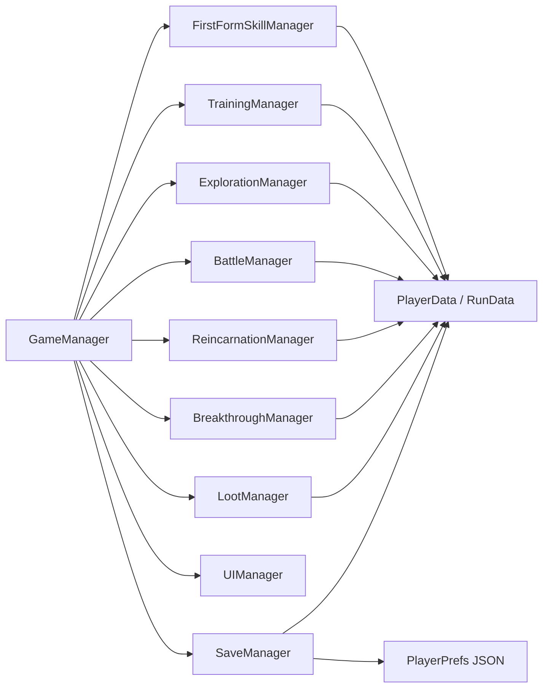

# 현재 시스템 감사

> 조사 기준: `codex/document-core-design-migration` 브랜치 생성 시점의 `main` (`33e4933`)
> Unity: `6000.5.0f1`
> 목적: 현재 구현을 삭제하거나 변경하지 않고 목표 구조로 옮길 경계를 확정한다.

## 1. 판정 기준

| 분류 | 의미 |
| --- | --- |
| 유지 | 현재 책임과 구현 패턴을 그대로 확장할 수 있음 |
| 수정 | 책임은 유효하지만 모델, 의존성 또는 흐름을 바꿔야 함 |
| 교체 | 새 구현을 병렬 도입하고 호환 어댑터 뒤에서 전환해야 함 |
| 폐기 후보 | 대체 구현과 저장 호환이 검증된 뒤 활성 경로에서 제거할 프로토타입 코드 |

`교체`와 `폐기 후보`는 이번 작업에서 삭제한다는 뜻이 아니다. 특히 구형 저장을 해석하는 enum, DTO, ID와 카탈로그는 마이그레이션 안정화 전까지 보존한다.

## 2. 현재 구조 요약

현재 코드는 `GameManager`가 단일 전역 상태를 전환하고, 일부 상태별 `MonoBehaviour` 매니저와 `GameManager`가 `Update()`에서 런타임 데이터를 직접 변경하는 세션형 프로토타입이다.

주요 호출 흐름은 다음과 같다.

- 시작: `GameManager.Awake()` → `ResolveManagers()` → `InitializeData()` → `SaveManager.TryLoadGame()` → `Start()` → `ChangeState()`
- 무공 선택: `UIManager` → `FirstFormSkillManager.SelectFirstFormSkill()` → `PlayerData.LearnFirstFormSkill()` → `GameManager.ConfirmFirstFormSkillSelection()`
- 수련: `TrainingManager.Update()` → `ApplyTrainingTick()` → `GameManager.EvaluateBreakthroughAfterTraining()`
- 출행: `GameManager.BeginBattle()` → `ExplorationManager` → `ExplorationEventManager` 또는 `BattleManager`
- 승리: `BattleManager.HandleEnemyDefeated()` → `GameManager.HandleBattleVictory()` → 혼백 포인트·전리품 지급 → 저장
- 사망·회귀: `GameManager.HandlePlayerDeath()` → `BodySelection` → `ReincarnationManager.SelectBody()` → `GameManager.StartNewRun()`

게임 콘텐츠 정의용 `ScriptableObject` 클래스나 에셋은 현재 없다. `Assets/ScriptableObjects/`는 비어 있고, 무공·출신·아이템·사건·적 정의는 C# 생성자와 정적 카탈로그에 하드코딩되어 있다.

## 3. 경지와 돌파

요청 항목에 언급된 `RealmData`와 `RealmManager`라는 클래스나 파일은 저장소에 없다. 실제 역할은 다음 코드에 분산되어 있다.

| 파일과 클래스 | 현재 책임 | 판정 | 목표 연결 |
| --- | --- | --- | --- |
| `Assets/Scripts/Core/GameTypes.cs`의 `RealmLevel` | `Initiate`, `Tempered`, `Skilled` 3값 enum | 교체, legacy 유지 | ordinal을 동결하고 구형 저장 입력으로만 사용 |
| `Assets/Scripts/Data/RealmProgressData.cs`의 `RealmRequirementData` | 검법·근력·최대 내력 조건 | 교체 | 병기·내공·선행 사건 등을 평가하는 범용 조건으로 전환 |
| 같은 파일의 `RealmProgressData` | 현재 경지, 돌파 가능·알림 여부 | 교체, legacy 유지 | 새 `RealmProgressState`는 안정 ID로 18단계를 저장 |
| `Assets/Scripts/Managers/BreakthroughManager.cs` | 조건 확인, 확률 판정, 실패 피해·사망 | 수정 | 판정 책임은 유지하되 대경지 직접 시작 시에만 실행 |
| `Assets/Scripts/Data/PlayerData.cs`의 `cultivationRealm` | 표시용 경지 문자열 | 폐기 후보 | `realmProgress`에서 계산한 view model로 대체 |
| `Assets/Scripts/Core/FirstFormBalance.cs` | 두 돌파의 요구치·성공률·보너스 | 수정 | 새 정의 데이터로 옮기고 legacy 수치 비교에 유지 |

현재 `TrainingManager.ApplyTrainingTick()`이 조건을 만족시키면 `BreakthroughManager.EvaluateAfterTraining()`이 곧바로 `BreakthroughSelection` 상태를 연다. 이는 “대경지 돌파는 사용자가 직접 시작한다”는 목표와 충돌한다. 목표에서는 소경지 상승만 자동 처리하고 대경지 조건 충족 시 보관 사건만 생성한다.

저장된 `RealmLevel`의 숫자값을 새 enum으로 단순 캐스팅하면 안 된다. 권장 legacy 매핑은 `Initiate → 삼류 초입`, `Tempered → 삼류 완숙`, `Skilled → 삼류 극`이며 단계별 저장 마이그레이터에서만 적용한다.

## 4. 입문 무공 선택

### 현재 구현

- `Assets/Scripts/Data/FirstFormSkillData.cs`는 이름, 설명, `FirstFormSkillType`, 공격·방어·내력 수치만 가진 `[Serializable]` 클래스다.
- `Assets/Scripts/Managers/FirstFormSkillManager.cs`의 `BuildCandidates()`가 청풍검식, 파문검식, 회류보 세 개를 매번 코드로 생성한다.
- `PlayerData.firstFormSkill`은 단일 슬롯이며 `ApplyBodyOrigin()`에서 초기화되지 않아 새 육신에도 그대로 남는다.
- `PlayerData.GetFirstFormTrainingMultiplier()`와 `BattleManager.ApplyFirstFormAttackBonus()`가 `FirstFormSkillType`을 직접 분기한다.
- 저장은 `selectedFirstFormSkillName`과 enum ordinal을 함께 기록하고 `FindCandidate()`가 이름 우선, 타입 순으로 복원한다.

### 판정

| 대상 | 판정 | 이유와 조치 |
| --- | --- | --- |
| 세 무공의 현재 전투 정체성 | 유지 | 검 수직 슬라이스의 기준 효과로 사용 가능 |
| `FirstFormSkillData` | 교체 | 안정 ID, 분류, 병기 적합성, 습득 조건, 숙련 4단계를 표현하지 못함 |
| `FirstFormSkillType` | 교체, legacy 유지 | 청풍·파문 검법과 공통 보법 회류보를 한 enum에 결합 |
| `FirstFormSkillManager` 고정 후보 | 폐기 후보 | 데이터 카탈로그와 습득 후보 서비스로 전환 |
| 단일 `PlayerData.firstFormSkill` | 교체 | 습득 목록, 활성 구성, 개별 숙련 상태가 필요 |
| 이름·ordinal 저장 | 폐기 후보 | `martial.sword.cheongpung`, `martial.sword.pamun`, `martial.footwork.hoeryu` 같은 ID로 전환 |

구형 무공 선택은 데이터 손실을 피하기 위해 새 저장의 `knownMartialArtIds`와 현재 생의 초기 활성 무공으로 함께 가져온다. 다음 생부터는 새로 선택한 병기 적합성을 다시 검사한다.

## 5. PlayerData, RunData, BodyOriginData

### PlayerData

`Assets/Scripts/Data/PlayerData.cs`는 다음 수명의 데이터를 한 객체에 혼합한다.

- 육신의 현재·최대 체력과 내력
- 검법 수치, 근력, 총 수련 시간
- 경지와 누적 경지 보너스
- 육신·출신 보너스
- 단일 무공
- 혼백 성장 복제본
- 이번 생 인벤토리
- 전투 피해, 회복, 무공 비용, 아이템 효과 계산

판정은 **분할 수정**이다. `LifeState`, 영구 `SoulState`, 콘텐츠 정의, 파생 능력치 계산기를 분리하고 전환 기간에는 기존 `PlayerData`를 어댑터로 둔다. 현재처럼 최대 체력에 장비·경지 효과를 직접 더하고 나중에 빼는 방식은 새 합성기와 함께 실행하면 보너스가 중복 적용될 위험이 있다.

### RunData

`Assets/Scripts/Data/RunData.cs`는 `currentRun`, 처치 수, 층, 행운, 출행 깊이, 생존 시간을 가진다. 생 번호와 생애 통계의 출발점은 유효하므로 **수정**한다.

목표에서는 `currentRun`을 legacy 필드명으로 유지하더라도 의미를 “생 번호”로 고정한다. 앱 재실행이 아니라 새 육신으로 다음 생을 시작할 때만 증가해야 한다. 활성 활동, 안전 정책, 체크포인트는 별도 `ActivityPlanState`와 `LifeState`에 둔다.

### BodyOriginData와 ReincarnationManager

`Assets/Scripts/Data/BodyOriginData.cs`는 육신과 출신을 하나의 능력치 보너스 묶음으로 표현한다. ID, 출신 태그, 무공·장비·사건·스승·인연 경로가 없다.

`Assets/Scripts/Managers/ReincarnationManager.cs`는 검문 제자, 마교 잡역, 약밭 견습 세 개를 하드코딩한다. 후보가 항상 세 종류라 실제로는 순서만 무작위이며, `CreateRunAdjustedBodyOrigin()`은 생 번호마다 체력·내력·검법·근력·공격의 다섯 정수 보너스에 누적 `+2`를 준다. 세 배율은 바꾸지 않는다.

- 후보 선택 책임과 기존 세 출신의 정체성: **유지**
- `BodyOriginData`: `BodyCandidateState`와 `OriginDefinition`으로 **교체**
- 표시 이름 복원과 하드코딩 풀: **폐기 후보**
- 생 번호 기반 직접 수치 상승: 해금 중심 혼백 성장과 충돌하므로 **교체**

첫 생은 `PlayerData.ResetForFirstRun()`의 “평범한 육신”으로 바로 시작해 후보 선택을 거치지 않는다. 새 흐름에서는 첫 생도 육신 후보와 병기 선택을 통과하도록 바꿔야 한다.

## 6. 수련, 출행, 사건, 전투

### TrainingManager

`Assets/Scripts/Managers/TrainingManager.cs`는 2초마다 검법·근력·최대 내력·회복을 적용하고, 중간 상태 전환이 없는 한 한 번의 수련 세션 35초 뒤 자동 출행한다. `Time.deltaTime`만 사용하므로 앱 종료 중 진행은 없고, 활동·목적·위험도를 선택할 데이터도 없다.

- 수련 보상 수치와 틱 공식: 수직 슬라이스 비교 기준으로 **유지**
- `Update()` 타이머와 무조건 출행: 구간 기반 활동 시뮬레이터로 **교체**
- `TrainingManager`: **수정**, 내부 시뮬레이션 코어는 교체하고 전환 기간 온라인 어댑터·controller로 유지

### ExplorationManager와 ExplorationEventManager

`Assets/Scripts/Managers/ExplorationManager.cs`는 `FirstFormBalance.ExplorationMessages` 세 문장을 2.2초 간격으로 진행하고 한 번 35% 사건 판정을 한 뒤 전투로 간다. 사건이 발생하면 `GameManager.TryBeginExplorationEvent()`가 전역 상태를 즉시 `ExplorationEvent`로 바꾼다.

`Assets/Scripts/Managers/ExplorationEventManager.cs`는 세 사건을 코드에서 만들며 현재 사건과 다음 전투 보정을 메모리에만 보유한다. 선택은 즉시 현 생의 체력·내력·검법·근력·최대 내력과 전리품에 적용되고, 일부 전리품 결과는 혼백 포인트로 이어질 수 있다. 일부 선택은 현재 체력에 따라 사망할 수 있다.

- `eventId`와 선택지 개념: **유지**
- 고정 메시지 출행과 즉시 전역 상태 중단: 활동 계획과 사건 보관함으로 **교체**
- choice enum별 직접 실행: 데이터 정의와 효과 해석기로 **교체**
- 현재 세 사건: 검 수직 슬라이스의 보류 사건 콘텐츠로 **유지 가능**

사건 발생과 해결을 분리해야 한다. 오프라인 시뮬레이터는 `ResolveChoice()`를 호출하지 않고 재굴림 방지용 발생 ID·시드·선택지 스냅샷을 저장한다.

### BattleManager

`Assets/Scripts/Managers/BattleManager.cs`는 실시간 타이머, `UnityEngine.Random`, 판정, 자동 방침, UI와 애니메이션 호출을 한 클래스에 담는다. 강공마다 3.2초 입력 창을 열고 입력이 없으면 자동 대응하지만, 자동 공격과 피격으로 일반 전투 중 실제 사망할 수 있다.

전투 규칙은 다음 구체 구현에 직접 결합된다.

- `PlayerData.swordMastery`
- `FirstFormSkillType`
- `LootItemCatalog`의 특정 ID
- `RealmLevel.Skilled`
- `currentBodyOrigin.Contains("마교")`, `Contains("약밭")`
- 특정 `EnemyArchetype`

| 부분 | 판정 | 목표 |
| --- | --- | --- |
| `Adaptive/Defensive/Aggressive` | 유지 | 저장 가능한 전투 방침의 초기값 |
| 공격 내역을 항목별로 분해하는 패턴 | 유지 | 순수 계산 결과의 진단 정보로 사용 |
| 실시간 연출·`RuntimeScenePresenter` 호출 | 수정 | 계산 결과를 소비하는 표현 어댑터로 한정 |
| 전투 판정 코어 | 교체 | `IClock`, `IRandomSource`를 쓰는 순수 C# 시뮬레이터 |
| 일반 전투 사망 경로 | 교체 | 안전 임계에서 귀환·부상·제한 손실 처리 |
| 이름·ID·enum 직접 분기 | 폐기 후보 | 태그, 조건, 효과 정의로 전환 |

앱을 닫으면 전투가 멈추고, 앱을 켠 채 자리를 비우면 사망할 수 있다. 현재 구현은 오프라인 진행도 부재 안전성도 지원한다고 볼 수 없다.

## 7. Loot와 장비

`Assets/Scripts/Data/ItemData.cs`의 `LootItemCatalog`는 다음 다섯 ID를 정적으로 생성한다.

- `rusty_sword`
- `worn_training_robe`
- `cracked_jade_token`
- `small_healing_pill`
- `faded_soul_stone`

`Assets/Scripts/Data/RunInventoryData.cs`는 `itemId`와 중첩 수를 저장하고 복제하는 최소 구조다. `Assets/Scripts/Managers/LootManager.cs`는 다섯 아이템을 균등 추첨하고, 최대 중첩이면 혼백 포인트로 자동 변환한다.

안정 ID와 이번 생 인벤토리라는 수명 경계는 **유지**한다. 다만 현재는 장비 슬롯, 장착 여부, 희귀도, 개별 인스턴스, 병기 계열, 시너지 태그, 자동 장착·보관·분해 규칙이 없다. 녹슨 검도 실제 주병기가 아니라 모든 공격에 적용되는 전역 배율이다.

- `RunItemStackData`의 ID 참조 패턴: **유지**
- `RunInventoryData`: 장비 인스턴스와 보관 정책을 수용하도록 **수정**
- `ItemData`/`LootManager`: 정의 카탈로그와 범용 효과·드롭 해석기로 **교체**
- `LootItemCatalog` 및 ID별 직접 분기: 마이그레이션 후 **폐기 후보**
- 기존 5개 ID: 의미를 바꾸거나 재사용하지 않고 legacy alias로 **영구 보존**

신병이기 관련 클래스나 데이터는 현재 전혀 없다.

## 8. 혼백 성장과 육신 선택

`Assets/Scripts/Data/SoulGrowthData.cs`는 혼의 맷집, 잔류 검의, 맑은 내력 세 가지 0~5레벨 직접 능력치만 가진다. 영구 상태 원본은 `SaveData.soulGrowth`이고 `PlayerData.soulGrowthData`는 복제본이라 강화 때 수동 동기화한다.

- 영혼 포인트와 영구 프로필 개념: **유지**
- 현재 세 성장 레벨: 삭제하지 않고 legacy 노드로 **유지**
- 직접 능력치 중심의 장기 성장: 해금·정보·자동 규칙 중심으로 **수정**
- `SaveData`와 `PlayerData` 두 위치의 복제 보관·수동 동기화: 단일 `SoulState` 원본으로 **교체**

전생 기억, 사건 정보, 병기 경험, 자동 규칙 해금, 신병이기 인연은 아직 구현되지 않았다.

## 9. UIManager와 RuntimeUIBuilder

### 수용 가능한 부분

- `UIManager.ShowState()`와 상태별 패널 전환 개념
- 버튼 인덱스를 캡처해 매니저 호출로 연결하는 패턴
- `RuntimeUIBuilder`가 빈 씬 구동 확인용 fallback UI를 만드는 기능
- `RuntimeScenePresenter`의 시각 표현 책임

### 구조 변경이 필요한 근거

- `Assets/Scripts/UI/UIManager.cs`는 `FirstFormGameState` 하나당 패널 하나를 직접 소유하고 여러 switch로 표시 여부를 정한다.
- serialized 선택 배열의 기본 크기, 현재 후보 공급자와 `RuntimeUIBuilder` fallback은 세 개를 전제로 한다. 무공·육신 표시 메서드는 연결된 배열 길이를 순회할 수 있지만 공급 데이터는 세 개로 고정되어 있고 탐험 사건 UI는 정확히 세 선택지를 순회한다.
- `Assets/Scripts/UI/RuntimeUIBuilder.cs`도 카드, 버튼, 라벨을 각각 세 개씩 하드코딩한다.
- 새 상태 하나를 추가하면 `GameTypes`, `GameManager`, `UIManager`, `RuntimeUIReferences`, `RuntimeUIBuilder`, `RuntimeScenePresenter`의 분기를 함께 바꿔야 한다.
- `UIManager.HasAnyAssignedUI()`는 UI 필드 하나만 수동 연결되어도 런타임 UI 전체 생성을 건너뛰므로 부분 연결에 취약하다.
- `GameManager.Update()`가 매 프레임 `UIManager.RefreshAll()`을 호출한다.

판정은 **현재 껍데기 수정 후 유지, 흐름·목록 표현 교체**다. 오프라인 보고, 사건 보관함, 활동 계획, 위험 행동 상세는 `DecisionViewModel`과 동적 목록 presenter가 소비해야 한다. 보관함은 전역 진행 상태를 바꾸는 enum이 아니라 현재 활동 위에 열리는 화면이어야 한다. `RuntimeUIBuilder`는 같은 view model을 소비하는 개발용 fallback으로 남긴다.

## 10. 저장 데이터와 마이그레이션 위험

현재 저장 조합은 다음과 같다.

- 저장소: `PlayerPrefs`
- 키: `SaveManager.SaveKey = "FirstForm.SaveData.v1"`
- DTO: `Assets/Scripts/Data/SaveData.cs`의 `SaveData.version = 3`
- 직렬화: `JsonUtility`
- 단일 JSON이며 애플리케이션 수준의 백업·체크섬·원자 교체 절차가 없음

### 실제 저장되는 데이터

- 선택한 입문 무공 이름과 enum ordinal
- 생 번호와 육신 표시 이름
- 구형 경지 enum ordinal
- 현재 생의 지속형 전리품 ID와 중첩
- 혼백 포인트와 세 성장 레벨
- 총 사망·승리 수
- 저장 시각

### 저장되지 않는 핵심 데이터

- 현재 체력·내력과 최대 내력 수련 진척
- `swordMastery`, `strength`, `totalTrainingTime`
- `RunData`의 처치 수, 층, 행운 획득 수, 출행 깊이, 생존 시간
- 현재 게임 상태, 활동 종류, 활동 시작·체크포인트
- 전투 방침, 자동 귀환 규칙
- 현재 사건, 보관 사건, 다음 전투 보정
- 육신 후보와 선택 도중 상태

`SaveManager.ApplySaveData()`는 로드 때 `ResetForFirstRun()` 후 육신·경지·아이템 보너스를 다시 조립한다. 따라서 같은 육신과 생 번호는 남아도 경지 사이에 쌓은 수련 수치와 현재 활동은 사라진다. 이는 “한 육신의 생이 여러 접속에 걸쳐 이어진다”는 목표와 직접 충돌한다.

### 위험 목록

| 위험 | 현재 근거 | 영향 |
| --- | --- | --- |
| 버전 분기 없음 | `version`은 `Sanitize()`에서 최소값만 보정 | 필드 의미 변경을 탐지·변환하지 못함 |
| 키와 DTO 버전 불일치 | 키는 `v1`, DTO 기본값은 3 | 운영자가 키 이름을 스키마 버전으로 오해할 수 있음 |
| enum ordinal 저장 | 경지·무공을 int로 저장 | enum 삽입·재정렬 시 다른 의미로 로드 |
| 표시 이름 참조 | 무공·육신 이름으로 복원 | 이름 변경·현지화 시 데이터 연결 실패 |
| 알 수 없는 아이템 삭제 | `SaveData.Sanitize()`가 로드된 메모리 DTO에서 카탈로그 미등록 ID를 제거 | 로드 후 다음 저장에서 복구 불가능한 손실 |
| 알 수 없는 필드 보존 없음 | `JsonUtility` DTO 재저장 | 미래 버전 저장을 구버전에서 열면 정보 유실 가능 |
| 저장 시각 미사용 | `savedAtUnixTime`은 기록만 함 | 오프라인 정산 기능이 실제로 없음 |
| 종료 체크포인트 없음 | 선택·승리·사망 등 특정 이벤트에서만 저장 | 앱 종료 시 중간 진척 유실 |
| 단일 저장 슬롯/PlayerPrefs 키 | 원본 백업·검증·복구 없음 | 손상 또는 실패한 migration에서 복구 어려움 |
| 파생 보너스 재적용 | 경지·아이템·혼백 효과를 수치에 직접 가감 | 구·신 계산 경로 병행 시 이중 적용 가능 |

사망 직후 저장해도 체력과 `Death` 상태를 저장하지 않으므로 재실행하면 같은 생·육신이 정상 체력의 수련 상태로 돌아올 수 있다. 이는 새 저장 설계 전에 characterization test로 고정해야 할 현재 동작이자, 목표 포맷에서는 바로잡아야 할 결함이다.

### 필수 안전선

1. 기존 키와 JSON 원문을 읽기 전용 legacy 원본으로 보존한다.
2. 구형 enum 순서와 기존 5개 item ID를 동결한다.
3. `LegacySaveV1/V2/V3`와 단계별 순수 migrator를 둔다.
4. `Sanitize()` 전에 migration하고, 알 수 없는 ID는 삭제 대신 격리한다.
5. 새 저장을 shadow-write한 뒤 의미 검증과 재로드에 성공해야 활성화한다.
6. 마이그레이션 실패 시 기존 원본으로 되돌릴 수 있어야 한다.
7. 구형 저장 golden JSON과 중간 생 재접속 회귀 테스트를 먼저 만든다.

## 11. 종합 분류표

| 기능/파일 | 주 분류 | 결론 |
| --- | --- | --- |
| `GameManager` 상태 전환 | 수정 | 프로토타입 조정자로 유지하되 활동·도메인·저장·UI 책임 분리 |
| `RealmLevel`/`RealmProgressData` | 교체 + legacy 유지 | 기존 데이터 삭제 금지, 18단계 ID 매핑 어댑터 필요 |
| `BreakthroughManager` | 수정 | 자동 화면 진입 제거, 직접 시작한 대경지 판정만 담당 |
| `FirstFormSkillData`/`FirstFormSkillManager` | 교체 | 정의·습득·숙련·활성 구성을 분리 |
| `PlayerData` | 수정/분할 | 생애 상태, 영구 상태, 파생 계산 혼재 |
| `RunData` | 수정 | 생 번호·기록 개념은 유지 |
| `BodyOriginData` | 교체 | 육신 후보와 출신 정의 분리 |
| `ReincarnationManager` | 수정 | 선택 책임 유지, 하드코딩 풀과 생별 `+2` 제거 |
| `TrainingManager` | 수정, 시뮬레이션 코어 교체 | 실시간 전용 틱을 공통 활동 시뮬레이터로 전환하고 어댑터 책임 유지 |
| `ExplorationManager` | 교체 | 목적·위험·보관함 기반 활동으로 전환 |
| `ExplorationEventManager` | 교체 | 발생과 해결 분리, pending decision 사용 |
| `BattleManager` | 판정 코어 교체 | 연출과 자동 방침 개념은 유지 |
| `RunInventoryData` | 수정 | ID 패턴 유지, 장비 인스턴스·슬롯·정책 추가 |
| `LootItemCatalog` | 폐기 후보 | legacy ID alias는 유지 |
| `SoulGrowthData` | 수정/legacy 유지 | 직접 스탯 보존, 새 성장은 해금 중심 |
| `SaveData`/`SaveManager` | 교체 + legacy reader 유지 | 버전 저장소·migrator·백업 필요 |
| `UIManager` | 수정 | view model과 범용 선택 목록 필요 |
| `RuntimeUIBuilder` | 개발용 유지/수정 | 고정 3칸 콘텐츠 제거 |
| `RuntimeScenePresenter` | 수정, 시각 표현 책임 유지 | `FirstFormGameState`/`PlayerData` 직접 결합을 view model 입력으로 축소 |
| `FirstFormBalance` | 수정 | 현재 수치는 비교 기준, 새 콘텐츠 정의로 점진 이동 |

## 12. 현재 없는 필수 시스템

- 활동 계획과 오프라인 진행 시뮬레이터
- 부재 안전 경계와 자동 귀환 정책
- 오프라인 결과 보고서와 중복 정산 방지
- 사건 보관함과 재굴림 방지 스냅샷
- 병기 계열·선택·경험
- 무공 분류·습득 조건·개별 숙련
- 18단계 경지 사다리
- 장비 슬롯·개체·자동 장착·보관·분해 규칙
- 신병이기 정의, 실물 상태, 혼백 인연 상태
- 명시적 저장 migrator, 백업, 미해결 참조 격리
- 프로젝트 고유 EditMode/PlayMode 테스트와 스크립트 assembly 분리

`Packages/manifest.json`에는 Unity Test Framework가 있지만 `Assets` 아래 프로젝트 테스트나 `.asmdef`는 없다. 저장과 도메인 구조를 바꾸기 전에 golden save와 순수 C# 진행 테스트를 마련하는 것이 첫 회귀 안전장치다.
