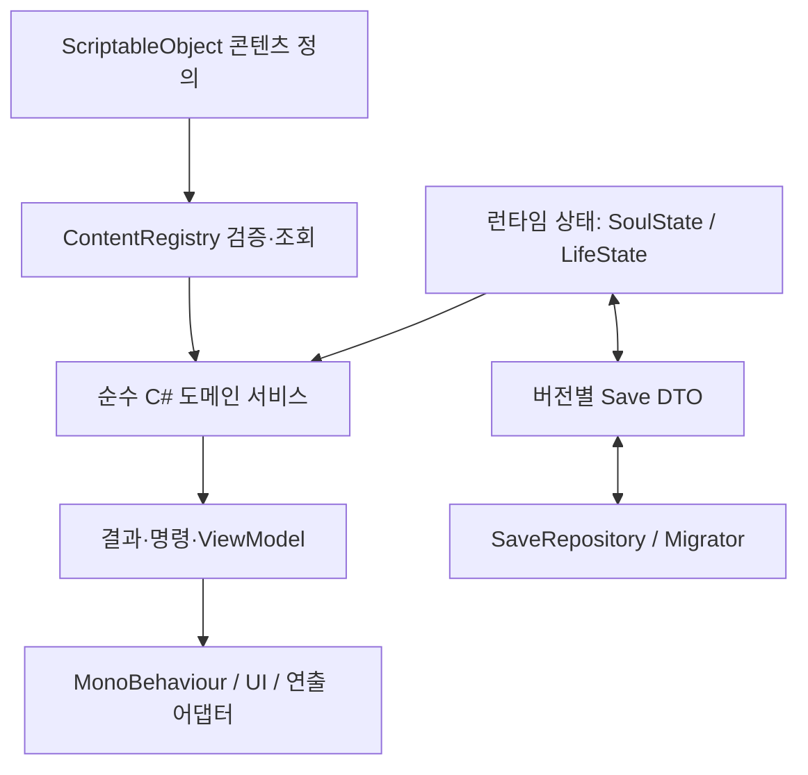
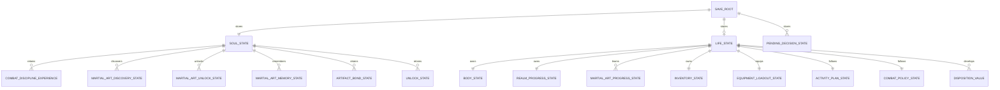

# 데이터 아키텍처 초안

> 문서 상태: 구현 전 설계 초안
> 원칙: 이 문서의 C#은 목표 계약을 설명하는 예시이며 이번 변경에서 실제 게임 코드나 저장 형식을 바꾸지 않는다.
> 관련 문서: [현재 시스템 감사](CurrentSystemAudit.md), [성장 및 전투 시스템](../GameDesign/ProgressionAndCombatSystems.md), [마이그레이션 계획](../Roadmap/CoreSystemMigrationPlan.md)

## 1. 설계 목표

1. 콘텐츠 정의, 한 생의 상태, 혼백 영구 상태, 저장 DTO의 수명을 분리한다.
2. 검 주전투 계열만 구현해도 다른 주전투 계열과 병기 계열을 데이터 추가로 수용할 수 있게 한다.
3. 온라인과 오프라인이 같은 순수 C# 규칙을 사용하고 동일 입력에 동일 결과를 낸다.
4. 표시 이름, enum ordinal, Unity asset GUID 대신 안정적인 콘텐츠 ID로 저장한다.
5. 구형 `SaveData`를 덮어쓰지 않고 단계적으로 새 포맷으로 옮긴다.
6. 알 수 없는 콘텐츠 참조를 삭제하지 않고 격리·복구할 수 있게 한다.
7. UI와 런타임 `MonoBehaviour`가 도메인 상태를 직접 소유하지 않게 한다.

## 2. 계층과 의존 방향



의존 방향은 아래로만 흐른다.

- 정의는 런타임 상태를 참조하지 않는다.
- 도메인 서비스는 `MonoBehaviour`, `Time`, `UnityEngine.Random`, UI를 참조하지 않는다.
- 저장 DTO는 `ScriptableObject` 참조나 `GameObject`를 포함하지 않는다.
- UI는 view model과 command를 통해 상태를 읽고 변경한다.

## 3. 권장 폴더 경계

실제 폴더 생성은 구현 단계에서 결정하되 책임은 다음처럼 나눈다.

```text
Assets/Scripts/
├─ Content/
│  ├─ Definitions/       # ScriptableObject 정의
│  ├─ Conditions/        # Inspector용 조건 데이터
│  └─ Registry/          # ID 인덱스와 검증
├─ Domain/
│  ├─ State/             # 순수 C# 런타임 상태
│  ├─ Simulation/        # 활동·전투·진척 계산
│  └─ Rules/             # 조건·효과·안전 정책
├─ Persistence/
│  ├─ Dto/               # 현재/legacy 저장 DTO
│  ├─ Migration/         # 단계별 migrator
│  └─ Store/             # 파일/PlayerPrefs 구현
├─ Presentation/
│  ├─ ViewModels/
│  └─ UnityAdapters/     # 기존 Manager/UI 연결
└─ Legacy/               # 기존 타입을 즉시 이동하지 않고 논리적으로만 격리
```

처음부터 물리적으로 모든 파일을 이동하면 Unity meta/GUID와 씬 참조 회귀가 커진다. assembly와 네임스페이스 경계를 먼저 만들고 파일 이동은 참조 검증 뒤 별도 작업으로 수행한다.

권장 assembly 경계는 다음과 같다.

```text
FirstForm.Domain              # UnityEngine 참조 없음
FirstForm.Persistence         # Domain 참조, 저장 DTO와 repository
FirstForm.Content.Unity       # Domain 참조, SO를 불변 콘텐츠 snapshot으로 변환
Assembly-CSharp legacy        # 위 assembly를 소비, 기존 Manager와 adapter는 당분간 유지
```

`FirstForm.Domain`은 `ScriptableObject`를 직접 받지 않는다. `FirstForm.Content.Unity`의 registry가 에셋을 main thread에서 검증하고 `IGameContentSnapshot` 형태의 불변 POCO로 변환해 전달한다. 오프라인 계산과 배경 작업은 생성 완료된 snapshot만 읽으며 Unity object에 접근하지 않는다. 새 asmdef에서 아직 `Assembly-CSharp`에 남아 있는 legacy 타입을 역참조하지 않도록 adapter는 전환 기간 legacy assembly 쪽에 둔다.

## 4. 콘텐츠 정의

현재 `FirstFormSkillManager.BuildCandidates()`, `ReincarnationManager.CreateCandidatePool()`, `LootItemCatalog`, `ExplorationEventManager.BuildEventCatalog()`에서 코드로 만드는 데이터를 읽기 전용 `ScriptableObject` 정의로 옮긴다.

P0.2의 첫 구현은 P0.1 reflection assembly 경계와 SampleScene 무참조 부트스트랩을 유지하기 위해 `Assembly-CSharp` 안의 source-authored POCO 정의를 검증 완료된 snapshot으로 사용한다. 이는 stable ID, 정의 관계와 validator를 먼저 고정하는 과도기다. 이후 `ScriptableObject` authoring adapter는 같은 snapshot 계약을 생성해야 하며, 저장과 도메인 규칙은 SO 참조나 asset GUID를 직접 소유하지 않는다. 구현 근거와 현재 alias 표는 [P0.2 산출물 문서](P0_2StableIdContentCatalog.md)에 기록한다.

### 공통 기반

```csharp
public abstract class ContentDefinition : ScriptableObject
{
    [SerializeField] private string stableId;
    [SerializeField] private int contentRevision;
    [SerializeField] private string displayName;

    public string StableId => stableId;
    public int ContentRevision => contentRevision;
    public string DisplayName => displayName;
}
```

`stableId`는 최초 배포 후 의미와 값을 바꾸지 않는다. 표시명과 현지화 키는 변경할 수 있지만 저장 참조에는 사용하지 않는다.

권장 ID 예시는 다음과 같다.

- `origin.sword_sect_disciple`
- `combat_discipline.sword`
- `weapon_family.sword`
- `martial.sword.cheongpung`
- `martial.sword.pamun`
- `martial.footwork.hoeryu`
- `realm.third_rate.entry`
- 기존 아이템은 이미 배포된 `rusty_sword` 등의 ID를 그대로 유지

### 정의 목록

| 정의 | 핵심 데이터 | 현재 근거 |
| --- | --- | --- |
| `OriginDefinition` | 태그, 시작 보정, 습득 비용·출현 가중치, 시작 경로 | `BodyOriginData`, `ReincarnationManager.CreateCandidatePool()` |
| `CombatDisciplineDefinition` | 이번 생의 주전투 계열, 성장 규칙, 전투 태그, 허용 무공 | 신규. 현재는 검 전투 경험이 `swordMastery`에 암묵적으로 고정 |
| `WeaponFamilyDefinition` | 실제 병기·전투 장비 계열과 장착 태그 | 신규. 검·권갑·완갑 등 실제 장착 적합성 표현 |
| `MartialArtDefinition` | 분류, 적합 주전투 계열·장착 병기, 습득 조건, 숙련 임계, 효과 | `FirstFormSkillData`, `FirstFormSkillManager` |
| `RealmLadderDefinition` | 18단계 순서, 소경지 조건, 대경지 사건 ID | `RealmProgressData`, `FirstFormBalance` |
| `ItemDefinition` | 일반 아이템 ID, 중첩, 사용 효과 | `ItemData`, `LootItemCatalog` |
| `EquipmentDefinition` | 슬롯, 병기 계열, 태그, 장착 조건, 효과 | 신규 |
| `DivineArmamentDefinition` | 유래, 전용 효과, 조건, 시험, 반동, 각성 | 신규 |
| `ActivityDefinition` | 수련·회복·제작·채집·출행 비용과 산출 | `TrainingManager`, `ExplorationManager` |
| `EventDefinition` | 발생 조건, 선택지, 보관 등급, 권위 있는 결과 payload와 미리보기 | `ExplorationEventData` |
| `EnemyDefinition` | 전법, 기본 능력, 보상, 위험 등급 | `EnemyData` |
| `LootTableDefinition` | 조건부 드롭과 가중치 | `LootManager.GrantRandomLoot()` |

```csharp
[CreateAssetMenu(menuName = "FirstForm/Combat Discipline")]
public sealed class CombatDisciplineDefinition : ContentDefinition
{
    [SerializeField] private string[] compatibleWeaponFamilyIds;
    [SerializeField] private bool allowsUnarmed;
    [SerializeField] private string[] startingMartialArtIds;
}

[CreateAssetMenu(menuName = "FirstForm/Weapon Family")]
public sealed class WeaponFamilyDefinition : ContentDefinition
{
    [SerializeField] private string[] weaponTags;
}
```

`CombatDisciplineDefinition`은 이번 생의 주전투 계열을, `WeaponFamilyDefinition`은 실제 장착 병기의 물리 계열을 정의한다. `combat_discipline.sword`를 선택했다고 검 실물을 소유한 것은 아니며, `EquipmentDefinition.weaponFamilyId`가 장착 instance의 실제 병기 계열을 제공한다.

### 무공 정의 예시

```csharp
public enum MartialArtCategory
{
    WeaponTechnique,
    Footwork,
    InternalArt,
    ExternalArt
}

[CreateAssetMenu(menuName = "FirstForm/Martial Art")]
public sealed class MartialArtDefinition : ContentDefinition
{
    [SerializeField] private MartialArtCategory category;
    [SerializeField] private string[] compatibleCombatDisciplineIds;
    [SerializeField] private WeaponUseRequirementData weaponUseRequirement;
    [SerializeField] private EligibilityConditionData[] acquisitionConditions;
    [SerializeField] private MasteryThresholdData[] masteryThresholds;
    [SerializeField] private EffectDefinitionData[] effects;
}

[Serializable]
public struct WeaponUseRequirementData
{
    public bool weaponAgnostic;
    public bool allowsNoMainWeapon;
    public string[] compatibleWeaponFamilyIds;
}
```

`WeaponUseRequirementData`는 빈 배열의 의미를 추측하지 않는다. `weaponAgnostic = true`이면 장착 병기를 판정하지 않고, `weaponAgnostic = false`, `allowsNoMainWeapon = true`이면 `장착 없음` 또는 `compatibleWeaponFamilyIds` 중 하나를 허용한다. 두 값이 모두 `false`이면 열거한 병기 계열 중 하나의 실제 장착 병기가 필수다. 맨손은 유효한 무장 상태지만 가짜 `WeaponFamilyDefinition`이나 `EquipmentInstance`를 만들지 않는다.

청풍검식과 파문검식은 `WeaponTechnique`, `combat_discipline.sword`와 `weapon_family.sword` 필수 조건을 가진다. 회류보는 `Footwork`, `weaponAgnostic = true`로 주전투 계열·장착 병기에 무관하게 표현한다. 권법·장법은 `CombatDiscipline`으로 존재하고 개별 무공은 `allowsNoMainWeapon = true`와 권갑·완갑 계열 목록을 조합할 수 있다. validator는 `weaponAgnostic = true`인데 다른 병기 필드를 함께 설정하거나, 병기가 필수인데 호환 목록이 비어 있는 모순을 오류로 처리한다.

### 조건과 효과

Unity Inspector 편의를 위해 조건과 효과는 닫힌 데이터 구조를 우선한다.

```csharp
[Serializable]
public struct EligibilityConditionData
{
    public ConditionKind kind;
    public string targetId;
    public ComparisonKind comparison;
    public int intValue;
    public float floatValue;
}
```

장기 저장에 취약한 임의 다형 `SerializeReference` 트리를 곧바로 도입하기보다 `kind + targetId + value` 데이터를 런타임 evaluator로 컴파일한다. 새 조건 종류가 실제로 필요할 때 enum 끝에 추가하고, 저장에는 조건 enum이 아니라 선택 결과 스냅샷과 콘텐츠 revision을 기록한다.

### ContentRegistry

`GameContentCatalog`는 모든 정의를 stable ID로 인덱싱하고 에디터·빌드 검증을 수행한다. 도메인에는 SO 자체가 아니라 검증 완료된 `IGameContentSnapshot`을 제공한다.

- ID 중복과 빈 ID 금지
- alias가 가리키는 대상 존재 확인
- 무공의 주전투 계열·장착 병기·선행 무공 참조 확인
- 18개 경지의 순서·중복·대경지 경계 확인
- 드롭 테이블과 이벤트 결과 참조 확인
- 일반 장비와 신병이기 정의의 혼용 금지
- 순환 선행 조건과 도달 불가능 콘텐츠 경고

Unity asset GUID는 에셋 연결용일 뿐 저장 ID로 쓰지 않는다.

## 5. 런타임 상태

### 소유권 관계



### SoulState

사망·생애 정리와 새 육신을 넘어 유지되는 단일 원본이다.

```csharp
[Serializable]
public sealed class SoulState
{
    public int soulPoints;
    public List<string> unlockedOriginIds;
    public List<string> unlockedCombatDisciplineIds;
    public List<CombatDisciplineExperienceState> combatDisciplineExperience;
    public List<MartialArtDiscoveryState> martialArtDiscoveries;
    public List<MartialArtUnlockState> martialArtUnlocks;
    public List<MartialArtMemoryState> martialArtMemories;
    public List<MemoryState> otherMemories;
    public List<KnownEventState> knownEvents;
    public List<ArtifactBondState> artifactBonds;
    public AutomationUnlockState automationUnlocks;
    public LegacySoulGrowthState legacyGrowth;
}
```

현재 `SoulGrowthData`의 세 레벨은 `legacyGrowth`에 손실 없이 보존한다. 전환 밸런스가 승인되기 전 자동 환산하지 않는다.

무공 관련 혼백 상태의 책임은 다음처럼 분리한다.

```csharp
[Serializable]
public sealed class MartialArtDiscoveryState
{
    public string martialArtId;
    public List<string> discoveredAcquisitionRouteIds;
    public int firstDiscoveredLifeNumber;
}

[Serializable]
public sealed class MartialArtUnlockState
{
    public string martialArtId;
    public string unlockSourceId;
    public bool availableAsStartingChoice;
}

[Serializable]
public sealed class MartialArtMemoryState
{
    public string martialArtId;
    public string memoryRuleId;
    public int reacquisitionRateBonusPermille;
    public MartialArtMasteryStage rememberedAchievement;
}
```

`MartialArtDiscoveryState`는 존재와 습득 경로에 대한 정보, `MartialArtUnlockState`는 다음 생의 시작 선택 자격, `MartialArtMemoryState`는 재습득 보정과 깨달음 기록만 표현한다. 어느 상태도 다음 생의 `MartialArtProgressState`를 자동 생성하거나 무공 사용권을 부여하지 않는다. 발견·해금·현생 습득을 한 필드에 섞지 않는다.

### LifeState

한 육신이 여러 접속에 걸쳐 이어지는 데 필요한 모든 원본 상태를 가진다.

```csharp
[Serializable]
public sealed class LifeState
{
    public string lifeId;
    public int lifeNumber;
    public string bodyCandidateId;
    public int bodySeed;
    public string originId;
    public string primaryCombatDisciplineId;

    public ResourceState resources;
    public BaseProgressState baseProgress;
    public RealmProgressState realm;
    public List<MartialArtProgressState> martialArtProgress;
    public List<DispositionValue> dispositions;
    public InventoryState inventory;
    public EquipmentLoadoutState loadout;
    public List<InjuryState> injuries;
    public ActivityPlanState activityPlan;
    public CombatPolicyState combatPolicy;
    public long lastSimulatedAtUnixMilliseconds;
    public long simulationSeed;
    public long nextRandomSequence;
    public long simulationRemainderTicks;
    public string rngAlgorithmVersion;
}
```

현재 저장에서 빠진 체력, 내력, 검법/주전투 계열 경험, 근력, 수련 진척, 활동 상태를 이 층이 책임진다. 최대 체력·공격력 같은 파생값은 저장 원본을 계속 가감하지 않고 `StatAggregationService`가 기본값 + 육신 + 출신 + 경지 + 현생 무공 + 장비 + 혼백 보정을 합성한다.

시간은 부동소수 `deltaTime` 누적값이 아니라 고정 정수 simulation tick으로 계산한다. `simulationRemainderTicks`는 한 활동 단위에 못 미친 나머지를 다음 정산으로 넘긴다. `nextRandomSequence`와 `rngAlgorithmVersion`은 런타임·플랫폼 업데이트 뒤에도 같은 난수 흐름을 재현하기 위한 상태다.

### 경지와 무공 숙련

```csharp
[Serializable]
public sealed class RealmProgressState
{
    public string realmStageId;
    public long stageProgress;
    public string pendingMajorBreakthroughDecisionId;
}

public enum MartialArtMasteryStage
{
    Introduction,  // 입문
    MinorSuccess,  // 소성
    MajorSuccess,  // 대성
    Perfection     // 극성
}

[Serializable]
public sealed class MartialArtProgressState
{
    public string martialArtId;
    public long masteryExperience;
    public MartialArtMasteryStage highestAchievedStage;
    public string acquisitionSourceId;
}
```

무인의 경지는 `realmStageId`, 현생 무공과 숙련은 무공별 `MartialArtProgressState`/`MartialArtMasteryStage`로 분리한다. 밸런스 임계값이 패치되어도 이미 달성한 현생 무공 숙련을 강등하지 않도록 `highestAchievedStage`를 하한으로 사용한다. 생애 결산 시 이 목록은 기본적으로 종료되고, 별도 계승 규칙이 허용한 결과만 `MartialArtDiscoveryState`, `MartialArtUnlockState` 또는 `MartialArtMemoryState`로 변환한다.

### 장비와 인벤토리

```csharp
[CreateAssetMenu(menuName = "FirstForm/Equipment")]
public sealed class EquipmentDefinition : ContentDefinition
{
    [SerializeField] private EquipmentSlot slot;
    [SerializeField] private string weaponFamilyId;
    [SerializeField] private string[] equipmentTags;
}

public enum EquipmentSlot
{
    MainWeapon,
    Armor,
    MovementRelic, // 이동 보조 장비 슬롯의 내부 예시 이름
    Accessory
}

[Serializable]
public sealed class EquipmentInstanceState
{
    public string instanceId;
    public string definitionId;
    public int definitionRevision;
    public int rollSeed;
    public List<RolledStatState> rolledStats;
    public List<string> affixIds;
    public bool locked;
}

[Serializable]
public sealed class EquipmentLoadoutState
{
    public string mainWeaponInstanceId;
    public string armorInstanceId;
    public string movementRelicInstanceId;
    public string accessoryInstanceId;
}
```

현재 중첩형 `RunItemStackData`는 재료와 소모품에 유지할 수 있다. 개별 옵션·귀속이 필요한 장비만 instance ID를 사용한다. 자동 장착·보관·분해 정책은 장비 자체가 아니라 `LootPolicyState`에 저장한다. 장비 옵션과 육신 후보는 seed만 저장해 나중에 다시 굴리지 않고, 실제로 확정된 수치·특성·definition revision을 snapshot으로 저장한다. seed는 감사와 재현 보조 정보다.

기존 `rusty_sword`, `worn_training_robe`, `cracked_jade_token` 중첩은 초기 전환에서 `LegacyEquipmentProjection`으로 표현한다. projection은 stack을 소비하지 않는 가상 장착·적합성 표시이며 기본 능력치 효과는 기존 adapter 한 곳에서만 적용한다. stack→instance 변환 규칙이 별도 승인되기 전에는 legacy projection을 자동 분해하거나 수량 변환하지 않는다.

`primaryCombatDisciplineId`는 이번 생의 주전투 계열이고, 장착 병기 적합성은 `EquipmentLoadoutState.mainWeaponInstanceId → EquipmentInstanceState.definitionId → EquipmentDefinition.weaponFamilyId`로 평가한다. `equippedWeaponFamilyId`를 별도 필드로 캐시하더라도 원본은 장착 instance와 정의이며 불일치하면 캐시를 폐기한다.

`mainWeaponInstanceId`가 비어 있으면 가짜 병기 계열이나 instance 없이 `장착 병기 없음`을 뜻한다. 검 주전투 계열은 `combat_discipline.sword` + `weapon_family.sword` + 실제 검 instance로 연결한다. 권법·장법 주전투 계열은 맨손 상태 또는 권갑·완갑 병기 계열 장비를 무공 조건에 따라 허용한다.

`MovementRelic`은 데이터 코드 예시 이름이다. 사용자 문서와 UI에서는 `이동 보조 장비 슬롯(가칭: 신법구)`로 표시하며 최종 세계관 명칭은 별도로 결정한다. 표시명 변경이 저장 slot code를 바꾸지 않도록 둘을 분리한다.

### 신병이기

- `ArtifactManifestationState`: 현재 생에서 소유한 실물, 현재 상태와 장착. `LifeState` 소유.
- `ArtifactBondState`: 단서, 인연, 완료 시험, 각인, 알려진 반동과 각성 기록. `SoulState` 소유.

일반 `EquipmentInstanceState`의 희귀도 하나로 신병이기를 표현하지 않는다.

## 6. 활동 계획, 전투 방침, 사건 보관함

### ActivityPlanState

```csharp
[Serializable]
public sealed class ActivityPlanState
{
    public string activityDefinitionId;
    public string objectiveId;
    public RiskTier maximumRisk;
    public SafetyPolicyState safetyPolicy;
    public LootPolicyState lootPolicy;
    public long startedAtUnixMilliseconds;
    public long checkpointSequence;
}
```

수련, 회복, 제작, 채집, 일반 출행 전투는 같은 활동 시뮬레이션 계약을 쓴다. 구체적인 진행 규칙은 `ActivityDefinition`과 서비스가 해석한다.

### CombatPolicyState

현재 `AutoBattleResponseStyle.Adaptive/Defensive/Aggressive`를 안정 ID 또는 전략 enum의 초기값으로 보존한다. 추가로 다음 규칙을 저장할 수 있어야 한다.

- 체력·내력·소모품별 귀환 임계값
- 적 위험도와 전법별 허용/회피
- 안전, 균형, 공세 우선순위
- 특정 무공·소모품 사용 조건
- 미확보 전리품 한도

### PendingDecisionState

```csharp
public enum DecisionScope
{
    Life,
    Soul,
    World
}

public enum LifeEndDisposition
{
    Discard,
    ConvertToMemory,
    CarryOver,
    ResolveDuringLifeSummary
}

[Serializable]
public sealed class PendingDecisionState
{
    public string occurrenceId;
    public string definitionId;
    public int definitionRevision;
    public DecisionScope scope;
    public string scopeOwnerId;
    public string lifeId;
    public LifeEndDisposition lifeEndDisposition;
    public AuthoritativeLifeEndCommandBatchSnapshot lifeEndCommands;
    public PendingDecisionKind kind;
    public long createdAtUnixSeconds;
    public int resolutionSeed;
    public DecisionResolutionContextSnapshot resolutionContext;
    public DecisionCostBasis costBasis;
    public List<AuthoritativeDecisionOptionSnapshot> options;
    public PendingDecisionStatus status;
}
```

원본 정의 ID만 저장하면 패치 후 선택의 의미가 바뀔 수 있다. 실제로 제시된 option ID, **권위 있는 비용·효과 command payload**, 발생 revision과 seed를 스냅샷으로 보존하고 UI도 같은 payload에서 미리보기를 만든다. 해결 때 최신 `EventDefinition`으로 보상을 다시 계산하지 않는다. 이 payload는 실행 코드를 직렬화한 것이 아니라 타입과 필드가 허용 목록으로 검증되는 선언적 명령 데이터여야 한다. 대안은 해당 revision의 정의를 완전히 재현할 versioned content archive이며, 둘 중 하나가 없는 선택은 보관할 수 없다.

`costBasis`는 비용을 발생 시점 상태에 고정하는지, 해결 시점 현재 상태를 대상으로 다시 유효성 검사하는지를 정의한다. 경로·다음 전투 의존 효과는 `resolutionContext`로 해당 출행을 안전 정지하거나, 선택 후 최초 적격 전투에 적용되는 저장 토큰으로 변환한다. 컨텍스트가 끝났는데 적용 대상이 사라지는 결과를 만들지 않는다. 사건 범위인 `scope`와 해결 대상 컨텍스트인 `resolutionContext`는 서로 다른 개념이다.

사건 정의에는 생성 cooldown, 종류별 pending 상한과 중복 병합 규칙을 둔다. 중대 사건은 상한 때문에 버리거나 자동 확정하지 않는다. 상한에 도달하면 해당 종류를 생성하는 활동 분기만 안전하게 중단하고 다른 안전 활동은 계속한다. occurrence ID로 같은 정산의 중복 적재와 보상 재굴림을 막는다.

생애 결산은 `scope`와 `lifeEndDisposition`을 함께 검사해 다음 규칙을 한 번만 적용한다.

- 현재 육신의 체력·장비·NPC 관계에 의존하는 `Life` 사건은 기본적으로 `Discard`한다.
- 신병이기 단서와 전생 지식은 `ConvertToMemory`로 혼백의 단서·무공 발견·기타 기억 상태에 변환한다. 변환 결과는 발생 시 저장한 닫힌 허용 목록의 `lifeEndCommands`를 사용하며 최신 정의로 다시 굴리지 않는다.
- `CarryOver`는 처음부터 `Soul` 또는 `World` 범위로 명시된 영구 사건에만 허용한다.
- `ResolveDuringLifeSummary`는 발생 시 저장한 결정론적 정리 command만 생애 결산 transaction에서 실행하고 그 결과를 화면에 보여 준다. `options` 중 하나를 자동 선택하거나 대경지 돌파·문파 선택·신병 계약 같은 중대 결정을 대신 확정할 수 없다.
- 생애 정리로 중대 사건의 비용·실패를 우회하거나 같은 occurrence를 다시 생성할 수 없다. 폐기·변환·유지된 항목은 생애 결산 보고서에 기록한다.

`scopeOwnerId`는 사건 범위의 실제 소유자를 고정하고, `lifeId`는 모든 범위에서 사건이 발생한 생을 감사하기 위한 값이다. `Life` 범위에서는 두 값이 같은 활성 생을 가리켜야 한다. `Soul`·`World` 범위 사건은 활성 생이 바뀌었다는 이유만으로 적용 대상을 다시 계산하지 않는다. `Life + CarryOver`처럼 종료된 생을 계속 참조하는 조합은 validation 오류로 막는다.

육신 선택 도중 종료해 후보를 다시 굴리는 문제를 막기 위해 `BodyCandidateState[]`도 pending decision 또는 별도 저장 상태로 보존한다.

### RiskActionAttemptState

위험 행동은 판정 전에 attempt 자체를 저장한다.

```csharp
[Serializable]
public sealed class RiskActionAttemptState
{
    public string attemptId;
    public string definitionId;
    public int definitionRevision;
    public string lifeId;
    public string sourceDecisionOccurrenceId;
    public string chosenApproachId;
    public List<ResourceCostSnapshot> committedCosts;
    public long randomSeed;
    public long nextRandomSequence;
    public string rngAlgorithmVersion;
    public long preparedSaveRevision;
    public RiskActionStartSnapshot startSnapshot;
    public RiskActionProgressStage progressStage;
    public bool resultApplied;
}

[Serializable]
public sealed class RiskActionAttemptReceiptState
{
    public string attemptId;
    public string outcomeCode;
    public string reportId;
    public long committedSaveRevision;
}
```

시작 command는 현재 저장 revision을 확인한 뒤 비용 차감, 시작 상태 snapshot, 고정 seed·sequence, 첫 진행 단계를 하나의 `TryCommit`으로 저장한다. commit 성공 전에는 attempt를 실행하지 않는다. 앱 종료 후에는 같은 `attemptId`와 난수 sequence로 이어서 진행하며 비용을 다시 내거나 결과를 다시 추첨하거나 시도 전 상태로 취소할 수 없다. 결과 적용, 생애 결산 가능 결과, attempt 제거와 receipt 생성도 같은 revision transaction으로 저장한다. 활성 attempt와 같은 ID의 receipt는 동시에 존재할 수 없다. `resultApplied`는 최종 transaction의 중복 적용 guard이며, commit 뒤에는 활성 attempt 대신 receipt만 남는다. 활성 attempt가 남으면 같은 입력으로 재개하고 receipt가 있으면 이미 완료된 것으로 보아 결과를 두 번 처리하지 않는다.

위험 행동이 진행 중인 생을 생애 정리하려 하면 정의된 종료 정책에 따라 attempt를 먼저 완료·중단 결산해야 한다. 단순 삭제나 새 attempt 생성으로 비용·실패 결과를 우회할 수 없다.

## 7. 순수 C# 시뮬레이션 서비스와 응용 조정자

권장 서비스 경계는 다음과 같다.

| 서비스 | 책임 |
| --- | --- |
| `ActivitySimulationService` | 경과 시간을 활동 구간으로 나누고 하위 판정 조정 |
| `CombatSimulationService` | 일반·위험 encounter의 판정과 전투 로그 생성 |
| `ProgressionService` | 현생 무공 숙련, 주전투 계열 경험, 소경지 진척 적용 |
| `EligibilityService` | 주전투 계열·장착 병기·출신·경지·선행·사건 조건 평가 |
| `LootResolutionService` | 드롭, 자동 장착·보관·분해 명령 생성 |
| `SafetyBoundaryService` | 자동 귀환, 부상, 손실 상한, 비가역 명령 차단 |
| `StatAggregationService` | 원본 상태와 정의에서 파생 능력치 계산 |
| `DecisionInboxService` | 사건 발생·중복 방지·해결 트랜잭션 |
| `RiskActionAttemptCoordinator` | 저장 repository와 도메인 판정을 조정해 위험 행동 attempt를 원자 시작·재개하고 결과를 멱등 적용하는 응용 계층 |
| `LifeSummaryService` | 사망·생애 정리 결산과 사건 disposition·혼백 이관 |

시간과 난수는 주입한다.

```csharp
public interface IClock
{
    long UtcNowMilliseconds { get; }
}

public interface IRandomSource
{
    int NextInt(int minInclusive, int maxExclusive);
    float NextFloat();
}
```

`Time.deltaTime`과 `UnityEngine.Random`을 도메인 규칙에서 직접 사용하지 않는다. 벽시계 밀리초는 고정 정수 simulation tick으로 변환한다. 난수는 알고리즘 버전이 고정된 counter-based 구현을 사용해 호출 순서와 sequence를 명시적으로 저장한다. 온라인은 짧은 자동 command 구간을 같은 서비스에 전달하고, 오프라인은 저장된 체크포인트부터 현재까지를 상한 안에서 전달한다.

같은 시작 상태·활동 계획·전투 방침·seed와 동일한 자동 command stream에는 온라인 구간 실행과 오프라인 일괄 실행이 같은 결과를 내야 한다. 수동 command가 있으면 해당 command 자체가 입력 차이로 기록되므로 결과가 달라도 결정론 위반이 아니다.

시뮬레이션은 가능하면 입력 상태를 직접 바꾸지 않고 `SimulationResult`를 반환한다. 저장 repository가 결과, 새 체크포인트, 오프라인 보고서를 한 트랜잭션으로 적용해야 중복 보상을 막을 수 있다.

### 부재 안전 변환

`SafetyBoundaryService`는 자동 진행에서 나온 치명·비가역 명령을 다음처럼 처리한다.

- 치명 피해 → 최소 생존 상태, 자동 귀환, 회복 가능한 부상
- 안전 정책이 허용한 범위의 미확보 일반 전리품 손실
- 대경지 돌파·문파·신병 계약 → pending decision 생성
- 고유 장비 파괴·혼백 정보 소실 → 명령 거부와 활동 중단
- 직접 시작한 위험 행동 중 앱 종료 → 원자 저장된 동일 `RiskActionAttemptState`에서 일시 정지

여기서 `마지막 안정 체크포인트`는 attempt가 없던 시도 전 상태가 아니다. 비용, 시작 snapshot, 고정 seed·sequence와 진행 단계가 저장된 상태를 뜻하며, 재접속은 그 attempt만 이어서 처리한다.

## 8. 저장 포맷

### 저장 루트

```csharp
[Serializable]
public sealed class SaveEnvelopeDtoV4
{
    public int schemaVersion;
    public string contentVersion;
    public long saveRevision;
    public long savedAtUnixSeconds;
    public string installationId;
    public SavePayloadDtoV4 payload;
}

[Serializable]
public sealed class SavePayloadDtoV4
{
    public SoulSaveDtoV4 soul;
    public LifeSaveDtoV4 activeLife;
    public RiskActionAttemptSaveDtoV4 activeRiskAttempt;
    public List<RiskActionAttemptReceiptSaveDtoV4> recentRiskAttemptReceipts;
    public NewLifeSelectionSaveDtoV4 newLifeSelection;
    public List<PendingDecisionSaveDtoV4> pendingDecisions;
    public List<OfflineReportSaveDtoV4> offlineReports;
    public List<UnresolvedReferenceSaveDtoV4> unresolvedReferences;
    public UserAutomationSettingsSaveDtoV4 automationSettings;
    public LegacyImportProvenanceSaveDtoV4 legacyImport;
}
```

여기서 v4는 현재 `SaveData.version = 3` 다음 후보를 설명하기 위한 이름이며 구현 착수 때 실제 배포 이력과 함께 확정한다. 저장 DTO와 `SoulState`/`LifeState` 사이에는 명시적 mapper를 둔다. 런타임 enum을 그대로 직렬화하지 않고 stable string ID 또는 한번 배포하면 값이 영구 고정되는 명시적 코드로 변환한다. 무인의 경지, 무공, 병기, pending 종류처럼 콘텐츠 의미가 있는 값은 string ID를 우선한다.

`NewLifeSelectionSaveDtoV4`는 활성 생이 없는 첫 생과 사망·생애 정리 결산 후 선택 구간을 저장한다. 후보 occurrence ID와 후보별 출신 ID, 확정 능력치·특성, 생성 revision·seed를 보존하므로 재접속으로 후보가 다시 굴려지지 않는다.

- `schemaVersion`: DTO 구조의 버전
- `contentVersion`: 정산과 pending snapshot이 참조한 콘텐츠 묶음 버전
- `saveRevision`: 중복 쓰기와 stale write 탐지용 단조 증가값
- `savedAtUnixSeconds`: 표시·진단용 저장 시각. 실제 정산 기준은 `LifeState.lastSimulatedAtUnixMilliseconds`와 정수 simulation tick 상태

체크섬은 악의적 조작 방지보다 손상 탐지 목적으로 사용할 수 있다. 보안 비밀을 클라이언트 저장에 포함하지 않는다.

### 저장소 추상화

```csharp
public interface ISaveStore
{
    SaveReadResult ReadActive();
    SaveCommitResult TryCommit(long expectedRevision, SaveEnvelopeDtoV4 nextEnvelope);
    bool TryRestoreBackup();
}
```

`TryCommit`은 현재 revision이 `expectedRevision`과 다르면 stale write를 거부한다. 내부에서는 `Application.persistentDataPath`에서 `temp write → flush → 재로드 검증 → backup → replace` 순서를 사용한다. 플랫폼 제약이 있는 경우 `PlayerPrefsSaveStore`를 구현할 수 있지만, legacy key와 새 활성 key를 분리한다.

### 직렬화 선택

현재 `JsonUtility`는 단순 DTO에는 적합하지만 필드 존재 여부, 알 수 없는 필드 보존, 동적 구조 처리에 한계가 있다. 구현 착수 전에 다음 두 경로를 비교하는 compatibility spike가 필요하다.

1. 버전별 닫힌 DTO와 `JsonUtility`를 유지하고 모든 migration을 명시적으로 작성
2. Unity 환경에서 검증된 JSON 라이브러리를 도입해 raw tree 기반 migration과 unknown field 보존 지원

어느 경로를 선택해도 도메인 객체를 직접 직렬화하지 않고 버전별 DTO와 mapper를 둔다. 라이브러리 선택은 이 문서에서 확정하지 않는다.

## 9. 구형 저장 호환

현재 `SaveManager`의 `SaveKey = "FirstForm.SaveData.v1"`과 원본 JSON은 새 저장이 검증될 때까지 수정·삭제하지 않는다.

저장소 이력에서 확인되는 wire shape는 네 종류다.

| 근거 커밋 | payload `version` | 확인된 형태 |
| --- | --- | --- |
| `9fa3e3c` | 1 | 최초 필드 집합인 `V1Initial` |
| `4368487` | 1 | `soulGrowth`가 추가됐지만 version이 같은 `V1WithSoul` |
| `0b08e49` | 2 | `currentRealmLevel`이 추가된 `V2Realm` |
| `a1a2884` | 3 | `runItems`가 추가된 현재 계열 `V3Loot` |

따라서 version 숫자만으로 두 v1 형태를 구분하면 안 되며 필드 존재 여부를 함께 검사해야 한다. 이 Git 이력은 스키마가 존재했다는 근거이지 각 형태가 실제 사용자에게 배포되었거나 실사용 저장 표본이 남아 있다는 증거는 아니다. P0는 현재 형식의 golden fixture와 원본 백업·최소 판별을 우선하고, 역사적 형태의 정식 지원 범위는 실제 배포 근거와 fixture를 확인해 확정한다. 존재가 확인되지 않은 버전을 추정해 DTO나 migrator를 만들지 않는다.

`LegacyImportProvenanceSaveDtoV4`에는 원본 key, raw JSON hash, legacy 저장 시각, import 시각과 생성된 새 save revision을 기록한다. 이미 import한 hash는 자동 재import하지 않는다. 사용자가 구버전 빌드로 돌아가 legacy 저장이 바뀐 뒤 다시 신버전을 실행하면 두 진행을 자동 병합하지 않고 충돌 사본으로 보존해 명시적 복구 대상으로 남긴다.

지원 버전보다 높은 `schemaVersion`을 만나면 fail-closed한다. 원문을 유지하고 해당 저장에 대한 읽기·쓰기를 거부하며 새 게임으로 덮어쓰지 않는다. UI에는 지원하지 않는 새 버전이라는 복구 가능한 오류를 전달한다.

### 명시적 매핑

| legacy 값 | 목표 ID/상태 |
| --- | --- |
| `RealmLevel.Initiate (0)` | `realm.third_rate.entry` |
| `RealmLevel.Tempered (1)` | `realm.third_rate.mature` |
| `RealmLevel.Skilled (2)` | `realm.third_rate.peak` |
| `StableSword (0)` / 청풍검식 | `martial.sword.cheongpung` |
| `RippleSword (1)` / 파문검식 | `martial.sword.pamun` |
| `FlowStep (2)` / 회류보 | `martial.footwork.hoeryu` |
| 주전투 계열 값 없음 | 현재 검 전용 프로토타입의 활성 생은 `combat_discipline.sword`로 추론 |
| 기존 세 육신 표시명 | 동결된 alias로 origin ID 매핑 |
| 알 수 없는 legacy 육신 이름 | 원문 격리 + `origin.ordinary_body` 중립 fallback |
| 기존 5개 item ID | 같은 ID로 유지 |

구형 저장에는 체력·내력·검법·근력·활동 상태가 없으므로 존재하지 않는 진척을 복원할 수 없다. 최초 migration은 현 로더와 같은 출신 + 경지 + 장비 + 혼백 기준 상태를 구성하고, 손실이 새 migrator 때문이 아니라 legacy 포맷의 한계임을 진단 로그에 남긴다.

알 수 없는 ID나 이름은 삭제하지 않고 `UnresolvedReferenceSaveDtoV4`에 원문, 출처 필드, 수량과 migration 버전을 보존한다. 활성 생의 필수 `originId`가 미해결이면 중립 fallback을 적용하되 원래 이름을 버리지 않는다.

legacy 무공 이름과 enum ordinal이 서로 다른 항목을 가리키면 현재 로더와 같은 **알려진 이름 우선, 이름을 찾지 못할 때 ordinal fallback** 규칙을 적용하고 불일치 진단을 저장한다. 둘 다 해석되지 않으면 무공을 임의 부여하지 않고 원문을 격리한다.

### migration 순서

1. 원본 문자열과 키를 backup하고 raw hash를 계산한다.
2. 같은 hash의 성공한 import provenance가 있는지 확인한다.
3. 최소 header로 버전을 판별하고 미래 schema면 fail-closed한다.
4. 저장소 이력에서 확인된 wire shape에 맞는 DTO로 읽는다. 현재 확인된 형태는 `V1Initial`, version 값은 같지만 `soulGrowth`가 추가된 `V1WithSoul`, `V2Realm`, `V3Loot`다.
5. legacy sanitization 전에 단계별 migrator를 실행한다.
6. 콘텐츠 ID alias를 해석하고 미해결 참조를 격리한다.
7. 새 DTO와 import provenance를 shadow-write한다.
8. semantic validation과 재로드 round-trip을 수행한다.
9. expected revision이 일치할 때만 새 저장을 활성화한다.
10. 실패나 legacy 변경 충돌이면 원본과 양쪽 사본을 유지하고 새 게임으로 조용히 덮어쓰지 않는다.

## 10. 데이터 불변 조건과 검증

- 활성 생이 있으면 `lifeId`, `originId`, `realmStageId`, 활동 체크포인트가 유효해야 한다.
- 활성 생이 없고 새 생 시작이 필요하면 유효한 `NewLifeSelectionSaveDtoV4`가 있어야 한다.
- 무인의 경지 ID와 무공 숙련 enum을 서로 변환하거나 같은 필드에 저장하지 않는다.
- 런타임 enum ordinal은 저장 DTO에 직접 기록하지 않고 stable ID 또는 동결된 명시 코드로 매핑한다.
- `primaryCombatDisciplineId`는 주전투 계열을 참조하며 장착 병기 instance나 `WeaponFamily` ID를 대신하지 않는다.
- 장착 instance는 인벤토리에 존재하고 슬롯 및 `EquipmentDefinition.weaponFamilyId`와 호환되어야 한다.
- 검법 활성화에는 `combat_discipline.sword`와 검 병기 계열의 장착 병기가 모두 필요하다.
- 혼백의 무공 발견·해금·기억은 활성 생의 `MartialArtProgressState`를 자동 생성하지 않는다.
- pending occurrence ID는 저장 안에서 유일하고 해결된 항목은 두 번 보상하지 않는다.
- pending decision은 유효한 `DecisionScope`와 `LifeEndDisposition`을 가지며 생애 결산에서 한 번만 처리된다.
- pending 선택의 실제 비용·효과는 저장된 권위 payload 또는 재현 가능한 content archive와 일치해야 한다.
- 활성 위험 행동 attempt는 비용·seed·sequence·시작 snapshot·진행 단계와 결과 적용 여부를 가지며 시도 전 상태로 되돌리지 않는다.
- 오프라인 결과에는 사망, 대경지 확정, 문파 귀속, 신병 계약 명령이 없어야 한다.
- `lastSimulatedAtUnixMilliseconds`는 성공적으로 저장된 정산 이후에만 전진한다.
- 난수 algorithm version, seed, next sequence와 나머지 simulation tick이 함께 저장되어야 한다.
- 시계 역행은 0초, 비정상적으로 긴 공백은 설정 상한으로 제한한다.
- 알 수 없는 콘텐츠 참조는 경고와 격리 대상이지 자동 삭제 대상이 아니다.
- 정의 ID alias는 여러 현재 ID를 가리킬 수 없고, 배포된 ID를 다른 의미로 재사용하지 않는다.

## 11. 현재 클래스에서 목표 책임으로의 연결

| 현재 클래스 | 전환 중 어댑터 | 목표 책임 |
| --- | --- | --- |
| `PlayerData` | `LegacyPlayerFacade` | `LifeState`, `SoulState`, `StatAggregationService` |
| `RunData` | `LegacyRunAdapter` | 생 통계 + `ActivityPlanState` |
| `BodyOriginData` | 이름/보너스 alias | `BodyCandidateState`, `OriginDefinition` |
| `RealmProgressData` | `LegacyRealmAdapter` | `RealmProgressState`, `RealmLadderDefinition` |
| `FirstFormSkillData` | `LegacyMartialArtAdapter` | `MartialArtDefinition`, `MartialArtProgressState` |
| `TrainingManager` | 온라인 tick adapter | `ActivitySimulationService` |
| `ExplorationManager` | 기존 상태 presenter | 활동/encounter 시뮬레이션 |
| `ExplorationEventManager` | 기존 3사건 adapter | `DecisionInboxService`, `EventDefinition` |
| `BattleManager` | Unity 전투 presenter/controller | `CombatSimulationService`, `CombatPolicyState` |
| `LootManager` | 기존 보상 adapter | `LootResolutionService`, loot/equipment 정의 |
| `SaveManager` | `LegacySaveReader` | `SaveRepository`, `ISaveStore`, migrator chain |
| `UIManager` | 기존 panel host | 화면 router, view model, command dispatcher |
| `RuntimeUIBuilder` | 개발용 fallback | 범용 view model renderer |

이 연결은 한 번에 클래스를 교체하기 위한 청사진이 아니다. 각 어댑터 뒤에서 새 모델의 결과와 기존 결과를 비교하고, 완료 조건을 통과한 기능만 새 활성 경로로 전환한다.
